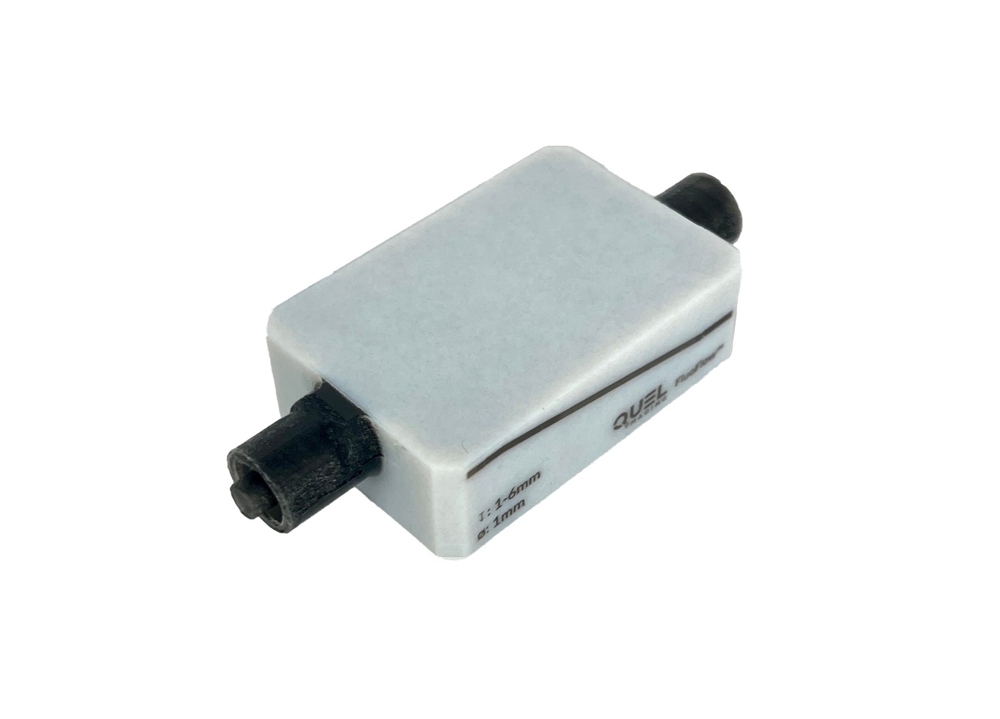
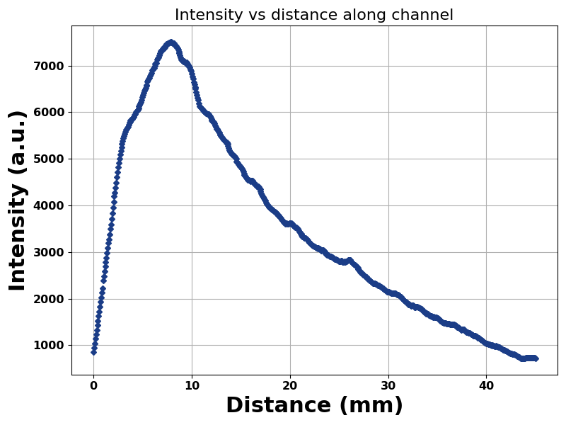
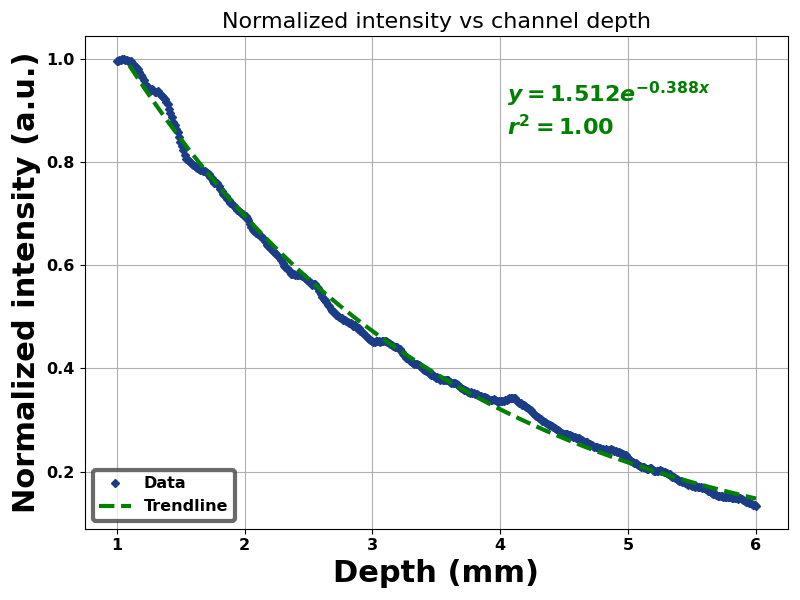
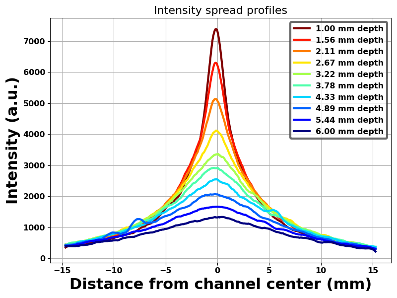
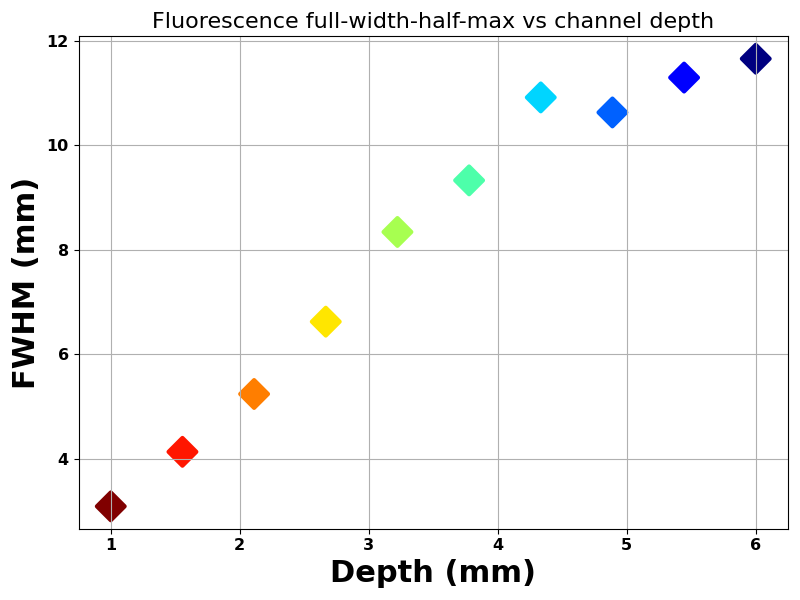

# Depth Resolution Phantom Analysis
This document details analysis methods for QUEL Imaging's depth resolution targets using the qal library. At a high level, the document is structured into three parts: a brief description of the target, followed by a "quick start section" showing basic use of the code, then a more detailed overview of how the code works, and finally, some examples.

<br/>

# Target Description
The depth resolution target consists of a block of non-fluorescent material of specified optical properties, with a hollowed out channel that varies in depth through the center for either a liquid fluorophore to be flowed through the channel (FluoFlow phantom, pictured below) or for an embedded fluorescent inclusion (custom phantom). It enables probing of an imaging system's fluorescence depth resolution with customizable bulk optical properties. See the use guide for FluoFlow phantoms (available here: https://shop.quelimaging.com/resources/) for more information on the phantom, including storage and cleaning procedures to use this phantom with fluorophores.
<p align="center">

</p>
<br/>

# Quick Start
The following block of code can be used to analyze an image of a depth resolution phantom and calculate/plot metrics about the intensity and spread. In addition to the qal library, it uses the scikit-image library (https://scikit-image.org/) to read in the image. This sample code and two other examples can be found in qal/examples/depth_resolution_example.py.

```python

import numpy as np
from qal.data import dr_sample1
from qal import PhantomCropper, DepthAnalyzer, DepthDataPlotter
from skimage import io
import matplotlib.pyplot as plt


im1 = io.imread('***replace-with-path-to-your-image***')
# Uncomment the line below to use our example image instead
# im1 = dr_sample1()

# Directories to save plots to if desired (change from None)
save_dir1 = None

# Crop the image
cropper = PhantomCropper()
cropper.crop_image(im1)

# Set dimensions and analyze CROPPER for relevant information
analyzer = DepthAnalyzer(cropper)
analyzer.depth_start_end = [1.3, 7.3] # z-depths (mm)
analyzer.descent_start_end = [6, 44] # x-positions (mm)
analyzer.phantom_dimensions = [35, 50] # y, x dimensions
analyzer.get_profiles(depths=np.linspace(1.3, 7.3, 10)) # same as depth_start_end, 10 points in between

# Plot data in ANALYZER
depth_data_plotter = DepthDataPlotter(analyzer.outputs)
depth_data_plotter.plot_data(graph_type='All', plot_smoothed=True, save_dir=save_dir1)


```


Upon executing this code, an image of the depth resolution target will be displayed and text will be shown on the plot, requesting that the user click on points in the image that will define the edges of the phantom for cropping, using the `PhantomCropper` class:
* Select a point on the top edge of the phantom
* Select a point on the bottom edge of the phantom
* Select a point on the left edge of the phantom
* Select a point on the right edge of the phantom

A new plot with the cropped phantom will be shown, with text saying "Close figure to continue". This cropped phantom will be an input for the analysis methods. 

Full execution of this code will generate the following plots:
* Intensity (a.u.) vs distance (mm) along channel
<p align="center">

</p>

* Normalized intensity (a.u.) vs channel depth with trendline fit
<p align="center">

</p>

* Intensity spread profiles: (Intensity (a.u.) vs distance from channel center (mm) at varying depths)
<p align="center">

</p>

* Fluorescence full-width-half-max vs channel depth of the intensity spread profiles
<p align="center">

</p>
<br/>

# Methodology
`crop_image()` from the `PhantomCropper` class takes an image, converts it to log scale, then displays the log scale image. The user is then prompted to select a point on the top, bottom, left, and right edges of the phantom. The points of each selection is stored and are used to crop the image by row value (top/bottom) column value (left/right).

`get_profiles()` uses the `DepthAnalyzer` class and is the main function used for analysis. The required inputs are:

    | Input  | Description |
    | ------------- | ------------- |
    | Depths  | Chosen depths for which to evaluate intensity spread |

Optionally, to change the dimensions of the phantom, the following code should be changed (also shown above in the example code):

```python
analyzer.depth_start_end = [1.3, 7.3] # z-depths (mm)
analyzer.descent_start_end = [6, 44] # x-positions (mm)
analyzer.phantom_dimensions = [35, 50] # y, x dimensions
```

The following metrics are then obtained:

## Intensity profiles:
Overview:

The intensity through the center of the channel of the phantom is found and smoothed. This is plotted against the x-dimension units (mm) of the phantom.

The intensity profile is also cropped to the descending portion of the phantom, which is mapped to the varying depth of the phantom. This cropped intensity is normalized and fit to an exponential function and is plotted.

Full list of variables that are obtained and stored:

| Output  | Description |
| ------------- | ------------- |
| Depths  | Chosen depths for which to evaluate intensity spread |
| Peak max | Maximum peak of intensity profile|
| Intensity profile | Array of intensity values along center of channel |
| Smoothed intensity profile | Smoothed values of intensity profile |
| Distance in mm | X-axis values of the phantom converted to distance in mm |
| Descent distance | The exponential decay of the intensity profile that is masked between the descent start and descent end |
| Descent depth | Depths of the descent (between the descent start and end)  |
| Intensities along descent | Intensities between the descent start and end |
| Smoothed intensities along descent | Smoothed intensities between the descent start and end |
| Vertical distance | Y-axis values of the phantom converted to distance in mm  |

## Spread profiles & FWHM:
    
Overview:

For n points between the start and ending depths, the intensity spread profile (the intensity across the y-axis), is obtained, smoothed, and plotted. This shows how the spread varies with depth. 

The full-width-half-max (FWHM) is calculated for each spread profile. As the depth increases, this value typically also increases, indicating a more diffuse spread. The FWHM vs depth is plotted.
    
For each depth, the following outputs are obtained and stored:
| Output  | Description |
| ------------- | ------------- |
| Spread profile  | Intensity spread values across y-axis |
| Smoothed spread profile | Smoothed intensity spread values |
| FWHM (smoothed)  | Full-width-half-max for the spread profile, smoothed |
| AUC (smoothed)  |  Area under the spread curve, smoothed |
| FWHM  | Full-width-half-max for the spread profile |
| AUC | Area under the spread curve |


`plot_data()` uses the `DepthDataPlotter` class to generate all the plots as mentioned above, using analyzer.outputs as the inputs for plotting.

<br/>


# Examples

## Example 1
The first example uses the image found at **qal/data/depth_resolution_targets/dr_sample1**. This code generates the plots as shown above for a standard FluoFlow phantom that has depths that vary between 1 - 6 mm.


```python
import numpy as np
from qal.data import dr_sample1
from qal import PhantomCropper, DepthAnalyzer, DepthDataPlotter
from skimage import io
import matplotlib.pyplot as plt
# EXAMPLE 1
# ------------------------------------------------------------------------------------------------------------------
# Load the example image of the depth resolution phantom
im1 = dr_sample1()

# Directories to save plots to if desired (change from None)
save_dir1 = None
# Crop the image
cropper = PhantomCropper()
cropper.crop_image(im1)

# Analyze CROPPER for relevant information
analyzer = DepthAnalyzer(cropper)
analyzer.get_profiles(depths=np.linspace(1, 6, 10))

# Plot data in ANALYZER
depth_data_plotter = DepthDataPlotter(analyzer.outputs)
depth_data_plotter.plot_data(graph_type='All', plot_smoothed=True, save_dir=save_dir1)
```
## Example 2
The second example uses the image found at **qal/data/depth_resolution_targets/dr_sample2**. This code generates the plots for a FluoFlow phantom, but in this case the intensity along the channel drops below 2%, so an additional line is added the to the FWHM plot to indicate this.

```python
import numpy as np
from qal.data import dr_sample2
from qal import PhantomCropper, DepthAnalyzer, DepthDataPlotter
from skimage import io
import matplotlib.pyplot as plt
# EXAMPLE 2
# ------------------------------------------------------------------------------------------------------------------
# FOR THE SECOND IMAGE, INTENSITY ALONG THE CHANNEL DROPS BELOW 2% SO AN ADDITIONAL LINE INDICATING THIS IS ADDED TO
# THE FHWM PLOT

# Load the example image of the depth resolution phantom
im2 = dr_sample2()

# Directory to save plots to if desired (change from None)
save_dir2 = None

# Crop the image
cropper = PhantomCropper()
cropper.crop_image(im2)

# Analyze CROPPER for relevant information
analyzer = DepthAnalyzer(cropper)
analyzer.get_profiles()

# Plot data in ANALYZER
depth_data_plotter = DepthDataPlotter(analyzer.outputs)
depth_data_plotter.plot_data(graph_type='All', plot_smoothed=True, save_dir=save_dir2)
```

## Example 3
The third example uses the image found at **qal/data/depth_resolution_targets/dr_sample3**. This example uses a custom phantom that has different dimensions than a standard FluoFlow phantom and has a fluorescent inclusion, rather than a liquid fluorophore. This code generates a plot of the cropped image with an inferno colormap and correct units (mm) on the axes, in addition to the analysis plots for that phantom.


```python
import numpy as np
from qal.data import dr_sample3
from qal import PhantomCropper, DepthAnalyzer, DepthDataPlotter
from skimage import io
import matplotlib.pyplot as plt

# Custom image
im3 = dr_sample3()

# Directories to save plots to if desired (change from None)
save_dir3 = None

# Crop the image
cropper = PhantomCropper()
cropper.crop_image(im3)

# Plot the cropped image with inferno colormap and unit dimensions
img = cropper.img
top = cropper.borders["top"]
bottom = cropper.borders["bottom"]
left = cropper.borders["left"]
right = cropper.borders["right"]

cropped = img[int(top):int(bottom), int(left):int(right)]
if (bottom - top) > (right - left):     # Check whether phantom orientation is vertical
    cropped = cropped.T
plt.imshow(np.rot90(cropped, 2), extent=[0, 50, 0 , 35], cmap='inferno') # change extent to x and y dimensions (mm)
plt.xlabel('X-axis (mm)', fontsize=16, fontweight='bold')
plt.ylabel('Y-axis (mm)', fontsize=16, fontweight='bold')
plt.show()


# Set dimensions and analyze CROPPER for relevant information
analyzer = DepthAnalyzer(cropper)
analyzer.depth_start_end = [1.3, 7.3] # z-depths (mm)
analyzer.descent_start_end = [6, 44] # x-positions (mm)
analyzer.phantom_dimensions = [35, 50] # y, x dimensions
analyzer.get_profiles(depths=np.linspace(1.3, 7.3, 10)) # same as depth_start_end, 10 points in between

# Plot data in ANALYZER
depth_data_plotter = DepthDataPlotter(analyzer.outputs)
depth_data_plotter.plot_data(graph_type='All', plot_smoothed=True, save_dir=save_dir3)
```
