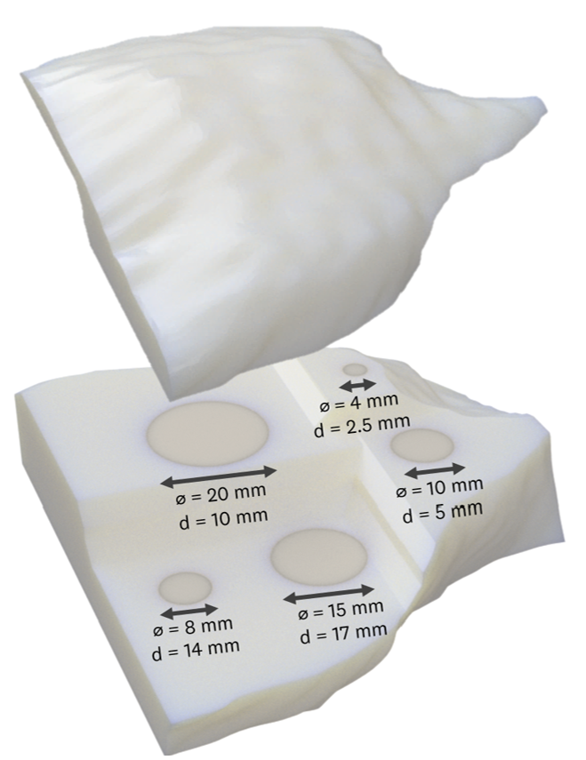
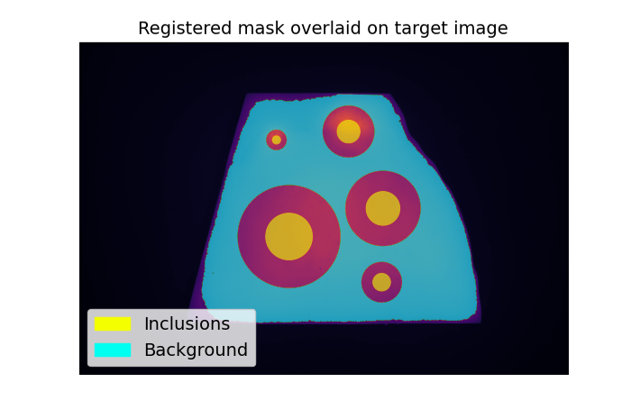
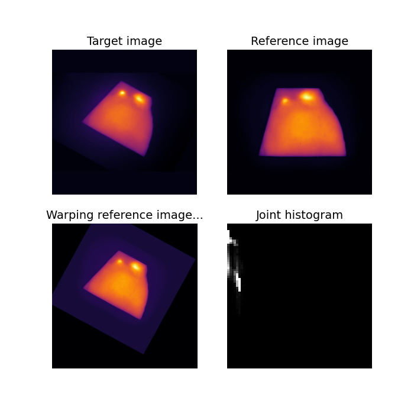
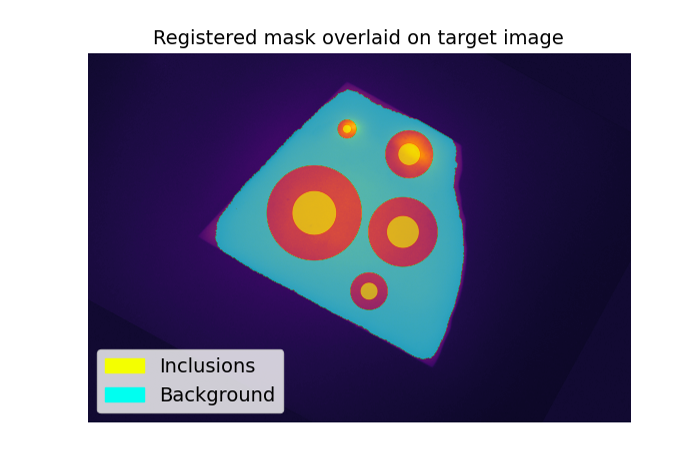

# Lung Phantom Analysis
This document details analysis methods for QUEL Imaging's lung phantom using the qal library. At a high level, the document is structured into four parts: a brief description of the phantom, a "quick start" guide, followed by a more detailed description of the analysis method, and finally, some examples.


# <br/>Phantom Description
The lung phantom is a 3D-printed lung resection, pictured below. It consists of two groups of parts: the body and the nodules. The bottom part of the body has cutouts into which the nodules (fluorescent inserts) are placed. The top part of the body encloses the fluorescent inserts such that the surface of each insert is a specified distance beneath the top surface of the phantom - the diameters and depths of the inserts are indicated in the image below. The body of the phantom has lung optical properties and can also contain some background fluorescence. A fluorescence image of the phantom can be analyzed for metrics such as signal-to-background ratio.
<p align="center">

</p>


# <br/>Quick Start
The following block of code can be used to analyze an image of the lung phantom and calculate metrics about the fluorescent inclusions. In addition to the qal library, it uses the scikit-image library (https://scikit-image.org/) to read in the image.
```python
from skimage import io
from qal import LungPhantom

im = io.imread("***Replace-with-path-to-your-image***")
save_dir = "***Replace-with-path-to-your-save-directory***"      # Or, replace string with None to not save

lung_phantom = LungPhantom()
metrics = lung_phantom.get_inclusion_stats(im, save_dir=save_dir)
print(f"\nSummary metrics:\n{metrics[0]}")
```
Running the code will display a dynamic figure that shows registration of the input image to the reference lung phantom image. After registration is complete, a second figure will display the input image overlaid with masks for the inclusions and phantom background. An example of this output is shown below:
<p align="center">

</p>

Finally, a table like the one below is printed to the screen. This contains summary metrics about the fluorescent inclusions in the input image: tumor-to-background ratio (TBR), contrast-to-noise ratio (CNR), and contrast-to-variance ratio (CVR). If provided, the metrics are also saved to Excel files within `save_dir`.
```
Summary metrics:
   Label  Inclusion diameter (mm)  Inclusion depth (mm)    TBR    CNR    CVR
0      1                        4                   2.5  1.387  2.498  2.234
1      2                        8                  14.0  1.067  0.430  0.416
2      3                       10                   5.0  1.449  2.902  2.146
3      4                       15                  17.0  1.197  1.274  1.231
4      5                       20                  10.0  1.213  1.378  1.310

Process finished with exit code 0
```

Note that, depending on how different your input image is from the reference image stored in the library, changes will be required to correctly register the images and extract metrics. Continue reading for an understanding of the methodology and how to adapt it.


# <br/>Methodology
The `LungPhantom` class employs an optimization function to register the reference image of the phantom to an input image, and thereby extract the following metrics about the fluorescent inclusions in the input image.
* Tumor-to-background ratio (TBR)

$$ TBR = {μ_{inclusion} \over μ_{background}} $$

* Contrast-to-noise ratio (CNR)

$$ CNR = {{μ_{inclusion} - μ_{background}} \over σ_{background}} $$

* Contrast-to-variance ratio (CVR)

$$ CVR = {{μ_{inclusion} - μ_{background}} \over \sqrt{σ_{inclusion}^2 + σ_{background}^2}} $$

where $\mu$ represents mean and $\sigma$ represents standard deviation. The following section describes the code in more detail.

## <br/>Extracting lung phantom metrics
A `LungPhantom` object contains a reference image and mask of the lung phantom when instantiated. The reference image is registered to an input image by minimizing the Kullback-Leibler measure (https://en.wikipedia.org/wiki/Mutual_information). In other words, the reference image is warped (scaled, rotated, and translated) until the joint histogram of the two images has maximized structure (minimized entropy). For the same image being registered to itself, the joint histogram will be a line along the diagonal when the two images are correctly registered. The minimization is done using Scipy's `optimize.fmin`.

The `LungPhantom` class has four parameters that can be defined, either upon instantiating the class or by calling the `update_params()` method. The parameters must be provided as a Python dictionary. They are:
<table>
<tr>
<td width="25%" align="right" valign="top">
Image shape for registration
</td>
<td width="75%">
The shape of images during registration. This should be square. Both the reference image and the target input image are reshaped to this size in order to compute the joint histogram. Images are padded with zeros, if necessary, to preserve the aspect ratio of the phantom in the image. Default is <code>[256, 256]</code>.<br/>
<br/>Note, the shape change is only for registration. After finding the optimal registration parameters, metrics are extracted from the original resolution input image.
</td>
</tr>
<tr>
<td width="25%" align="right" valign="top">
Initial registration parameters
</td>
<td width="75%">
A list of four values to be entered as initial guesses for registration. They are: scale, rotation (in radians), x-translation, y-translation. Choosing a good initial guess is important to avoid getting stuck in local minima during optimization, hence this parameter will almost always have to be changed. Default is <code>[1, 0, 0, 0]</code>.
</td>
</tr>
<tr>
<td width="25%" align="right" valign="top">
Number of histogram bins
</td>
<td width="75%">
Number of bins used in creating the joint histogram. Default is <code>64</code>.
</td>
</tr>
<tr>
<td width="25%" align="right" valign="top">
fmin delta x parameter
</td>
<td width="75%">
The <code>xtol</code> parameter in <code>scipy.optimize.fmin</code>. This is the absolute error in registration parameters between iterations that is acceptable for convergence. Default is <code>0.005</code>.
</td>
</tr>
</table>

To define parameters when instantiating the class, all parameters must be provided:
```python
lung_phantom = LungPhantom(params={
    "Image shape for registration": [256, 256],
    "Initial registration parameters": [1, 0, 0, 0],
    "Number of histogram bins": 64,
    "fmin delta x parameter": 0.005
})
```
Alternatively, one or a few parameters can be changed using the `update_params()` method:
```python
lung_phantom = LungPhantom()
lung_phantom.update_params({
    "Initial registration parameters": [0.8, 0.1, 10, 30]
})
```

<br/>Performing the registration and extracting metrics is done using the `get_inclusion_stats()` method. It requires a single input, which is the fluorescence image (given as a 2D array) of the lung phantom to be analyzed. For example, if the fluorescence image is represented by `im`, the code at its simplest will be:
```python
lung_phantom = LungPhantom()
metrics = lung_phantom.get_inclusion_stats(im)
```
The `get_inclusion_stats()` method also has four other optional inputs which can be changed in the function call. The table below lists all inputs to the function:
<table>
<tr>
<td width="25%" align="right" valign="top">
im_target
</td>
<td width="75%">
<i>Required</i>. The input fluorescence image of the lung phantom as a 2D array.
</td>
</tr>
<tr>
<tr>
<td width="25%" align="right" valign="top">
show_progress
</td>
<td width="75%">
<i>Optional</i>. A boolean flag for whether to display the progress of registering the reference image to the input image. If <code>True</code>, a live figure will display the current output of the registration process. This can help debug initial parameters and avoid getting stuck in local minima. Default is <code>True</code>.
</td>
</tr>
<tr>
<td width="25%" align="right" valign="top">
verbose
</td>
<td width="75%">
<i>Optional</i>. Whether to print updates to the screen. If <code>True</code>, the current iteration and the cost (value to be minimized) at that iteration is printed every <code>print_every</code> iterations. Default is <code>True</code>.
</td>
</tr>
<tr>
<td width="25%" align="right" valign="top">
print_every
</td>
<td width="75%">
<i>Optional</i>. Number of iterations between prints to the screen. Default is <code>10</code>.
</td>
</tr>
<tr>
<td width="25%" align="right" valign="top">
save_dir
</td>
<td width="75%">
<i>Optional</i>. Path to a directory in which to save outputs. If provided, the output metrics are saved to Excel files within this directory. Default is <code>None</code>, in which case the outputs are not saved.
</td>
</tr>
</table>

Example use:
```python
metrics = lung_phantom.get_inclusion_stats(im, show_progress=True, verbose=True, print_every=5)
```

## <br/>Creating lung reference image
As mentioned above, a `LungPhantom` object already contains a reference image and mask when instantiated. Should there be a need to update these references, the `create_reference_mask()` method can be used. This requires two images as inputs: an image of the phantom with the top on, and an image of the phantom with the top off with inclusions exposed (contact QUEL Imaging for imaging recommendations if needing to do this). If `im_phantom` and `im_inclusions` represent these two images respectively, the following code can be used to update the reference:
```python
lung_phantom = LungPhantom()
lung_phantom.create_reference_mask(im_phantom, im_inclusions)
```
The table below lists all inputs to the `create_reference_mask()` method:
<table>
<tr>
<td width="25%" align="right" valign="top">
phantom_image
</td>
<td width="75%">
<i>Required</i>. A fluorescence image of the lung phantom with the top on, provided as a 2D array.
</td>
</tr>
<tr>
<td width="25%" align="right" valign="top">
inclusions_image
</td>
<td width="75%">
<i>Required</i>. A fluorescence image of the lung phantom with the top off and inclusions exposed, provided as a 2D array.
</td>
</tr>
<tr>
<td width="25%" align="right" valign="top">
k
</td>
<td width="75%">
<i>Optional</i>. Kernel size for Opening transform to remove noise after thresholding. Default is <code>5</code>.
</td>
</tr>
<tr>
<td width="25%" align="right" valign="top">
min_area
</td>
<td width="75%">
<i>Optional</i>. Minimum area in pixels for identified regions to count as inclusions. Default is <code>100</code>.
</td>
</tr>
<tr>
<td width="25%" align="right" valign="top">
inclusion_rad
</td>
<td width="75%">
<i>Optional</i>. Fraction of the true radii of inclusions for which to draw the mask. Default is <code>0.7</code>. For example, if an inclusion is 100 pixels in radius, the mask for that inclusion will have a radius of 70 pixels.
</td>
</tr>
<tr>
<td width="25%" align="right" valign="top">
void_frac
</td>
<td width="75%">
<i>Optional</i>. Fraction of the radii of inclusions by which to expand empty space around the inclusion when generating the background mask. Default is <code>1.5</code>. For example, if an inclusion is 100 pixels in radius, the background mask will exclude a region centered on that inclusion that is 150 pixels in radius.
</td>
</tr>
<tr>
<td width="25%" align="right" valign="top">
save
</td>
<td width="75%">
<i>Optional</i>. Determines whether to save the new reference mask to the Reference folder in the library. Subsequent instances of <code>LungPhantom</code> will use this as reference. If <code>save</code> is <code>False</code>, the new reference mask and image are still stored in the instance of <code>LungPhantom</code> and can be used for analysis. Default is <code>True</code>.
</td>
</tr>
</table>

Example use:
```python
lung_phantom.create_reference_mask(im_phantom, im_inclusions, inclusion_rad=1, void_frac=1.2, save=False)
```


# <br/>Examples
## Extracting lung phantom metrics
The image used in this example is downloaded from the repository but can also be located: **qal/data/lung_test_image/lung_test_image.tiff**. First, the necessary imports are made:
```python
from qal.data import lung_test_image
from qal import LungPhantom
```
The input image is downloaded and then analyzed to obtain metrics. In this example, the metrics are not saved to Excel files, so `save_dir` is `None`.
```python
im = lung_test_image()

lung_phantom = LungPhantom()
lung_phantom.update_params({
    "Initial registration parameters": [0.75, 0.5, 25, 5]
})
metrics = lung_phantom.get_inclusion_stats(im, save_dir=None)
```
Finally, the summary metrics are printed to the screen:
```python
print(f"\nSummary metrics:\n{metrics[0]}")
```
Upon running this code, a figure is displayed that shows the progress of registering the reference image to the input target image. It shows the target image, the reference image, the current warped reference image, and the current joint histogram of the warped reference image and the target image. This figure updates upon every iteration of the optimization process.
<p align="center">

</p>

Additionally, text is printed to the screen every 10 iterations (function calls, different from `fmin`'s iterations), showing the current function value or "cost". When the optimization converges, a message is printed to the screen to this effect.
```
FINDING REGISTRATION PARAMETERS...
  Function call 1. Cost: -3.9152e-01
  Function call 11. Cost: -4.6987e-01
  Function call 21. Cost: -5.1536e-01
  Function call 31. Cost: -5.5279e-01
  Function call 41. Cost: -5.6769e-01
  Function call 51. Cost: -5.9224e-01
  Function call 61. Cost: -5.9437e-01
  Function call 71. Cost: -6.0404e-01
  Function call 81. Cost: -6.0412e-01
  Function call 91. Cost: -6.0484e-01
  Function call 101. Cost: -6.0516e-01
  Function call 111. Cost: -6.0497e-01
  Function call 121. Cost: -6.0511e-01
  Function call 131. Cost: -6.0516e-01
  Function call 141. Cost: -6.0536e-01
  Function call 151. Cost: -6.0535e-01
Optimization terminated successfully.
         Current function value: -0.605364
         Iterations: 77
         Function evaluations: 152
         Time taken: 90.14729881286621 s
         Optimal registration parameters: [ 0.83336541  0.50192043 19.35310422  6.29123591]
```
In addition to the convergence message, a figure is displayed showing the input image overlaid with the registered reference mask, which is used to obtain metrics.
<p align="center">

</p>

Upon closing this figure, summary metrics about the fluorescent inclusions are printed to the screen:
```
Summary metrics:
   Label  Inclusion diameter (mm)  Inclusion depth (mm)    TBR    CNR    CVR
0      1                        4                   2.5  1.754  4.036  3.424
1      2                        8                  14.0  1.029  0.155  0.149
2      3                       10                   5.0  1.588  3.148  2.309
3      4                       15                  17.0  1.177  0.946  0.902
4      5                       20                  10.0  1.310  1.662  1.583

Process finished with exit code 0
```

## Updating reference image
This example updates the reference image and mask used by the `LungPhantom` class. The images used are the original images that created the reference, and are located in the repository at: **qal/data/lung_reference_source**. Hence, this example can be run without fear of changing the default reference images. First, the necessary imports are made:
```python
from qal.data import lung_reference
from qal import LungPhantom
```
Next, the images are downloaded:
```python
im_phantom, im_inclusions = lung_reference()
```
Finally, the new reference is created and saved:
```python
lung_phantom = LungPhantom()
lung_phantom.create_reference_mask(im_phantom, im_inclusions)
```
Upon running these lines of code, the following is printed to the screen:
```
Obtaining phantom outline...
Making mask from image of inclusions...
Lung phantom reference image and mask successfully created and saved to [***absolute-path-to-Reference-folder***]

Process finished with exit code 0
```