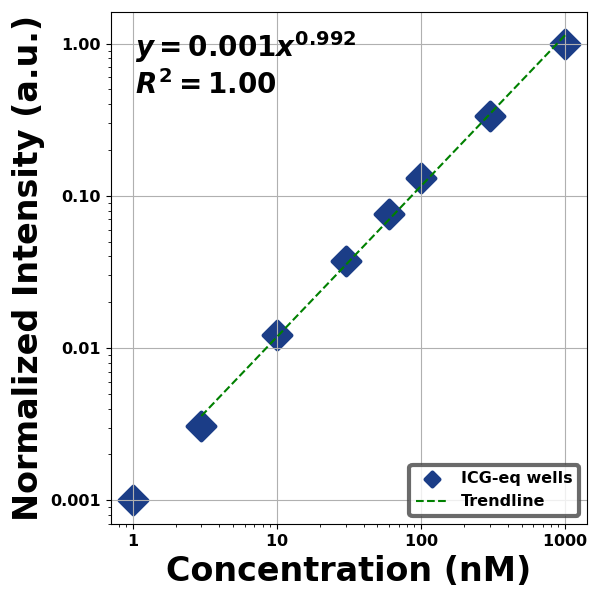
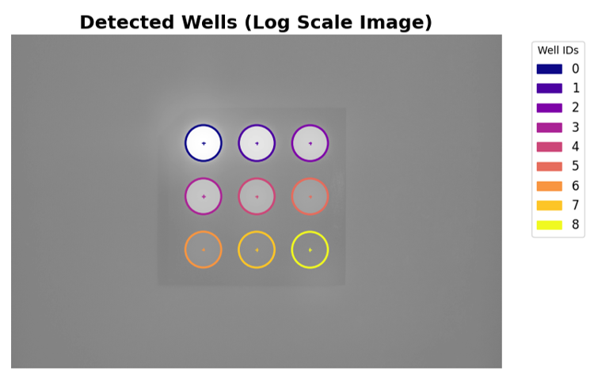
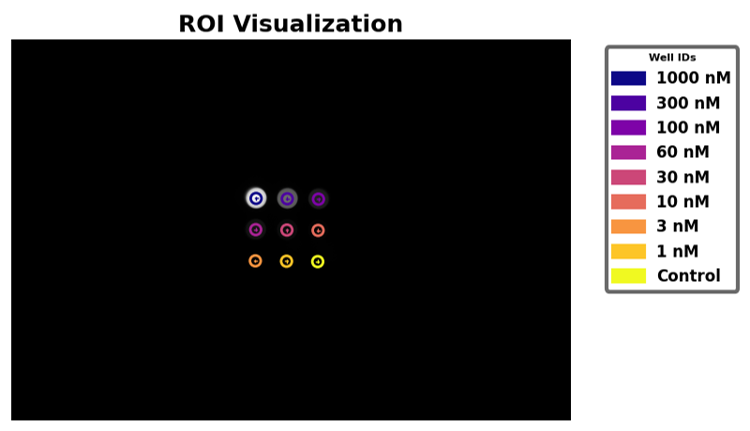
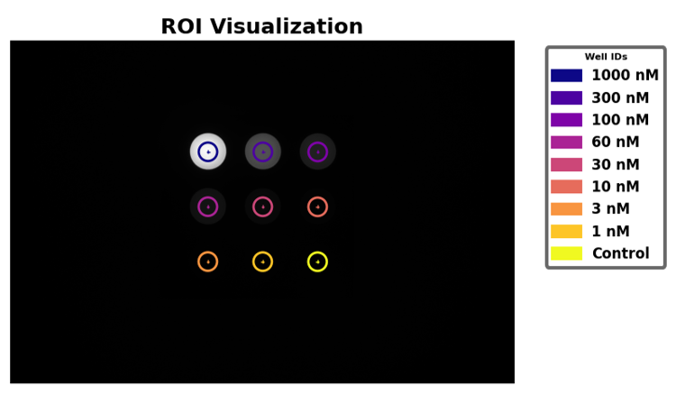
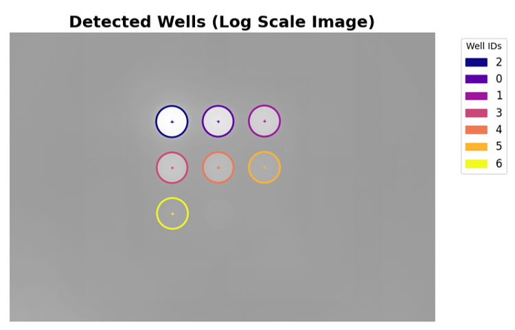
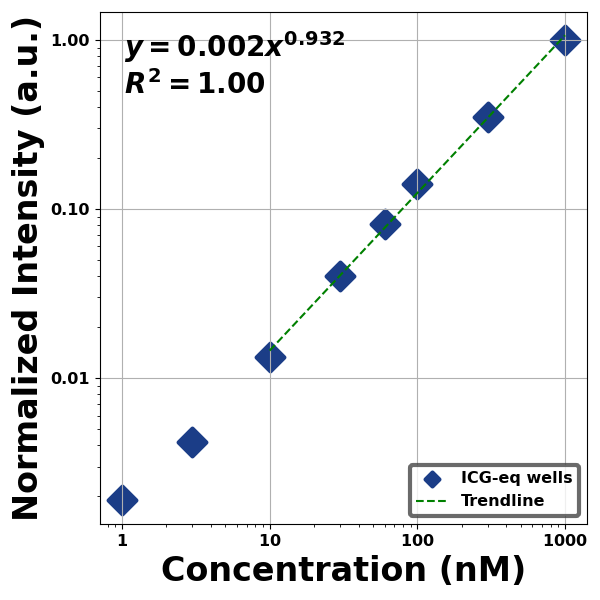
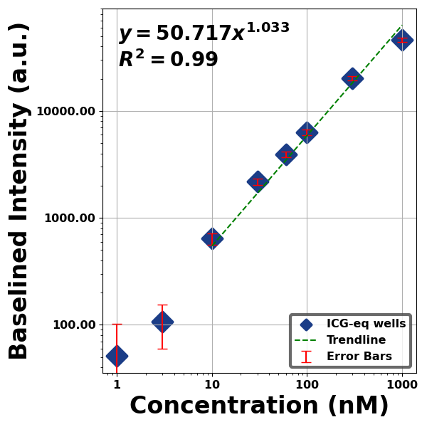

# Reference Concentration Target Analysis
This document details analysis methods for QUEL Imaging's reference concentration sensitivity (RCS) target using the qal library. At a high level, the document is structured into four sections: a brief description of the target, followed by a "quick start" section showing basic use of the code, then a more detailed overview of how the code works, and finally, some examples.

<br/>

# Target Description
The RCS target consists of nine wells with varying concentrations of fluorescent material embedded within a block of non-fluorescent and absorbing background material. It can be thought of as a dilution series to probe an imaging device's fluorescence sensitivity. See the use guide (available here: https://shop.quelimaging.com/resources/) for more information on the target, including imaging recommendations.

<br/>

# Quick Start
Below is a block of code that can be used to analyze an image of the RCS target. It assumes the fluorophore in the concentration target is "ICG-equivalent" and labels it as such. For a different fluorophore, change `fluorophore_label` in the last line (this only affects labeling on the plot). In addition to using the qal library, the code uses the scikit-image library (https://scikit-image.org/) to read in the image.
```python
from skimage import io
from qal.data import cn_sample_1
from qal import WellDetector, WellAnalyzer, WellPlotter

cn_im = io.imread('***replace-with-path-to-your-image***')
# Uncomment the line below to use our example image instead
# cn_im = cn_sample_1()

detector = WellDetector()
detector.detect_wells(cn_im)
cn_df = detector.estimate_remaining_wells_3x3(
    cn_im, 
    detector.df,
    well_ids=['1000 nM', '300 nM', '100 nM', '60 nM', '30 nM', '10 nM', '3 nM', '1 nM', 'Control']
)

analyzer = WellAnalyzer(cn_im, cn_df)
cn_df = analyzer.get_stats()

plotter = WellPlotter(cn_df)
plotter.plot(graph_type='concentration', col_to_plot='mean intensity normalized', fluorophore_label='ICG-eq',
             trendline_lib='statsmodels')
```
This code will produce a figure like the one below. On the y-axis is the baselined normalized intensity of the wells, plotted against the fluorophore concentration on the x-axis. The plot also shows a trendline fitted for the part of the curve where contrast-to-noise ratio (CNR) is above 3 &ndash; this cutoff is based on the recommendations of the [AAPM Task Group 311](https://aapm.onlinelibrary.wiley.com/doi/10.1002/mp.16849). Continue reading for a better understanding of the code and how to use it.
<p align="center">

</p>
<br/>

# Methodology
Analyzing an image of the RCS target involves a three-step process of:
* Identifying, localizing, and quantifying average intensities of fluorescent wells
* Data processing - Baselining, intensity normalization and contrast-to-noise calculation
* Visualization of results

<br/>

## Step 1 - Well identification, localization, and quantification
This step is accomplished using the `WellDetector` class. Note that by default, `WellDetector` uses parallel processing to speed up the detection of wells, which for a large image, can take a long time otherwise. For smaller images, the overhead involved with setting up parallel processing might make it less efficient than single thread processing. To disable parallel processing for a `WellDetector` object, set the `parallel_processing` attribute to `False` during initialization:
```python
detector = WellDetector(parallel_processing=False)
```

Two methods are used sequentially to obtain a dataframe containing information on the nine wells, including their centroid locations and average intensities. The first is `detect_wells()`, which identifies as many fluorescent wells as it can, based on their intensity. Often this may not be sufficient to identify all nine wells, so the second method, `estimate_remaining_wells_3x3()` is needed. This uses the already identified well positions and knowledge of the physical dimensions of the RCS target to estimate the locations of any remaining wells.

In its simplest form, the code for well identification for an RCS target looks like the following (where `cn_im` is an image of the RCS target):
```python
detector = WellDetector()
detector.detect_wells(cn_im)
cn_df = detector.estimate_remaining_wells_3x3(
    cn_im, 
    detector.df,
    well_ids=['1000 nM', '300 nM', '100 nM', '60 nM', '30 nM', '10 nM', '3 nM', '1 nM', 'Control']
)
```

The `detect_wells()` method takes an image of the RCS target (provided as a 2D array) as input. It also has four other optional inputs that can be provided in the function call. All inputs are defined below:
<table>
<tr>
<td width="25%" align="right" valign="top">
im
</td>
<td width="75%">
<i>Required</i>. A 2D array containing an image of the RCS target.
</td>
</tr>
<tr>
<td width="25%" align="right" valign="top">
well_ids
</td>
<td width="75%">
<i>Optional</i>. A list of IDs for the fluorescent wells. For RCS targets, the well IDs will generally be <code>['1000 nM', '300 nM', '100 nM', '60 nM', '30 nM', '10 nM', '3 nM', '1 nM', 'Control']</code>. By default, this is <code>None</code>. Note, it is also provided in the <code>estimate_remaining_wells_3x3()</code> method.
</td>
</tr>
<tr>
<td width="25%" align="right" valign="top">
show_detected_wells
</td>
<td width="75%">
<i>Optional</i>. Whether to display a figure showing the wells that were identified. Default is <code>False</code>.
</td>
</tr>
<tr>
<td width="25%" align="right" valign="top">
debug
</td>
<td width="75%">
<i>Optional</i>. If <code>True</code>, a figure is displayed that can help with debugging well-identification. Default is <code>False</code>.
</td>
</tr>
<tr>
<td width="25%" align="right" valign="top">
set_consistent_roi_region
</td>
<td width="75%">
<i>Optional</i>. If <code>True</code>, the ROIs within which average fluorescence intensity is calculated will have the same radius (otherwise the size of each ROI depends on the size of the region identified). Note that in <code>estimate_remaining_wells_3x3()</code>, all ROIs will be set to have the same radius. Default is <code>False</code>.
</td>
</tr>
<tr>
<td width="25%" align="right" valign="top">
downscale
</td>
<td width="75%">
<i>Optional</i>. An alternative to parallel processing to improve speed. Setting <code>downscale=0.5</code> means that the input image will be rescaled by a factor of one half before performing well detection. Since this step is only used to find the locations of the wells, it should not significantly alter results (subsequent analysis is still performed on the full resolution image). Default is <code>1</code>.
</td>
</tr>
</table>

The output of `detect_wells()` is a dataframe containing identified wells. This dataframe is also contained within the `df` attribute of the `WellDetector` instance. Assuming `cn_im` is an image of the RCS target, the dataframe can be obtained with:
```python
detector = WellDetector()
cn_df = detector.detect_wells(cn_im)
```
Or,
```python
detector = WellDetector()
detector.detect_wells(cn_im)
cn_df = detector.df
```

<br/>The `estimate_remaining_wells_3x3()` method takes in the same image of the RCS target as input, as well as the dataframe produced by the `detect_wells()` method. It also has two optional inputs. All inputs are defined below:
<table>
<tr>
<td width="25%" align="right" valign="top">
im
</td>
<td width="75%">
<i>Required</i>. A 2D array containing an image of the RCS target. This should be the same image supplied to <code>detect_wells()</code>.
</td>
</tr>
<tr>
<td width="25%" align="right" valign="top">
df
</td>
<td width="75%">
<i>Required</i>. A dataframe containing the wells identified by <code>detect_wells()</code>. If <code>detector</code> is an instance of <code>WellDetector</code>, then after running the <code>detect_wells()</code> method, the needed dataframe will be contained within <code>detector.df</code>.
</td>
</tr>
<tr>
<td width="25%" align="right" valign="top">
well_ids
</td>
<td width="75%">
<i>Optional</i>. A list of IDs for the fluorescent wells. For RCS targets, the well IDs will generally be <code>['1000 nM', '300 nM', '100 nM', '60 nM', '30 nM', '10 nM', '3 nM', '1 nM', 'Control']</code>. Default is <code>None</code>.
</td>
</tr>
<tr>
<td width="25%" align="right" valign="top">
show_detected_wells
</td>
<td width="75%">
<i>Optional</i>. Whether to display a figure showing the wells that were identified. Default is <code>False</code>.
</td>
</tr>
</table>

The output of this method is a dataframe that contains all nine wells. The dataframe will also be contained within the `df` attribute of the `WellDetector` instance. It will look like the following:
```
             x            y  ROI Diameter  ROI Radius     well   value
0  1813.478257  1177.750342    159.785714   79.892857  1000 nM  1000.0
1  2044.479767  1180.522820    159.785714   79.892857   300 nM   300.0 
2  2275.481277  1183.295298    159.785714   79.892857   100 nM   100.0 
3  1810.705779  1408.751852    159.785714   79.892857    60 nM    60.0 
4  2041.707289  1411.524330    159.785714   79.892857    30 nM    30.0  
5  2272.708799  1414.296808    159.785714   79.892857    10 nM    10.0 
6  1807.933301  1639.753363    159.785714   79.892857     3 nM     3.0 
7  2038.934812  1642.525840    159.785714   79.892857     1 nM     1.0 
8  2269.936322  1645.298318    159.785714   79.892857  Control     0.0
```
An example of calling this method with the optional input of showing the detected wells is as follows:
```python
cn_df = detector.estimate_remaining_wells_3x3(
    cn_im, 
    cn_df,
    well_ids=['1000 nM', '300 nM', '100 nM', '60 nM', '30 nM', '10 nM', '3 nM', '1 nM', 'Control'],
    show_detected_wells=True
)
```
In addition to outputting the complete dataframe, this will produce a figure like the one below, showing a log-scale image of the identified wells with numbered IDs ordered from highest to lowest fluorescence intensity:
<p align="center">

</p>
<br/>

## Step 2 - Data processing
This step is accomplished by using the `WellAnalyzer` class. `WellAnalyzer` must be initialized with two inputs. They are:
<table>
<tr>
<td width="25%" align="right" valign="top">
im
</td>
<td width="75%">
A 2D array containing an image of the RCS target. This should be the same image used in the first step.
</td>
</tr>
<tr>
<td width="25%" align="right" valign="top">
df
</td>
<td width="75%">
A dataframe containing the wells identified in the first step. This will be the output from calling <code>estimate_remaining_wells_3x3()</code>.
</td>
</tr>
</table>

Then, data is processed using the `get_stats()` method of `WellAnalyzer`. As the name implies, `get_stats()` simply calculates relevant statistics about the image of the RCS target. These are then used in the final step to visualize results. Given an image of the RCS target called `cn_im`, and the output from Step 1 called `cn_df`, obtaining statistics goes as follows:
```python
analyzer = WellAnalyzer(cn_im, cn_df)
cn_df = analyzer.get_stats()
```
`get_stats()` has one optional input, `region_of_well_to_analyze`, that is the fraction of the well's diameter for which to calculate statistics. By default, this is `0.5` (recommended).

The output of the `get_stats()` method is also a dataframe which now contains additional statistics about the nine wells, including normalized intensity and contrast-to-noise ratio (CNR). It will look like this:
```
             x            y  ROI Diameter  ROI Radius     well   value  Analyzed ROI Diameter  mean intensity  standard deviation  mean intensity baselined  mean intensity normalized  standard deviation normalized          CNR
0  1625.676103   915.759762    303.071429  151.535714  1000 nM  1000.0             151.535714    59760.951652         1487.735624              58889.346240                   1.000000                       0.035744  1298.179120
1  2076.616129   916.349125    303.071429  151.535714   300 nM   300.0             151.535714    20439.588340          525.006204              19567.982928                   0.332284                       0.012272   431.364049
2  2527.556154   916.938488    303.071429  151.535714   100 nM   100.0             151.535714     8629.352925          270.957039               7757.747513                   0.131734                       0.005731   171.014733
3  1625.086741  1366.699788    303.071429  151.535714    60 nM    60.0             151.535714     5373.131288          185.975263               4501.525876                   0.076440                       0.003781    99.233347
4  2076.026766  1367.289150    303.071429  151.535714    30 nM    30.0             151.535714     3053.348200          126.267235               2181.742788                   0.037048                       0.002463    48.095167
5  2526.966791  1367.878513    303.071429  151.535714    10 nM    10.0             151.535714     1591.042094           77.388832                719.436682                   0.012217                       0.001554    15.859536
6  1624.497378  1817.639813    303.071429  151.535714     3 nM     3.0             151.535714     1052.401752           54.535719                180.796340                   0.003070                       0.001207     3.985543
7  2075.437403  1818.229176    303.071429  151.535714     1 nM     1.0             151.535714      930.205833           47.848387                 58.600421                   0.000995                       0.001120     1.291810
8  2526.377429  1818.818539    303.071429  151.535714  Control     0.0             151.535714      871.605412           45.363036                  0.000000                   0.000000                            NaN     0.000000
```
<br/>

## Step 3 - Visualization
This final visualization step involves calling the `plot()` method of the `WellPlotter` class. This will plot relevant data (e.g., normalized mean intensity) versus fluorophore concentration. A `WellPlotter` object must be initialized with a dataframe containing statistics about the nine wells of the RCS target - i.e., the output from calling the `get_stats()` method of `WellAnalyzer`. For example, if `cn_df` is the dataframe containing well statistics, create a `WellPlotter` object using:
```python
plotter = WellPlotter(cn_df)
```
`WellPlotter` can additionally be initialized with the image of the concentration target. This form of initialization is recommended if intending to use the `visualize_roi()` method (discussed later):
```python
plotter = WellPlotter(cn_df, image=cn_im)
```

The `plot()` method, used to display analysis results, has six optional inputs that can be defined:
<table>
<tr>
<td width="25%" align="right" valign="top">
graph_type
</td>
<td width="75%">
A string indicating the type of target that is being analyzed. Options are <code>'concentration'</code> for RCS targets, and <code>'depth'</code> for RDS targets. Default is <code>'concentration'</code>.
</td>
</tr>
<tr>
<td width="25%" align="right" valign="top">
col_to_plot
</td>
<td width="75%">
A string indicating the column of the input dataframe to plot. Note that not all columns of the dataframe make sense to plot. It is recommended to plot <code>'mean intensity normalized'</code>, which is the average intensity of the wells normalized between 0 and 1 after subtracting the average intensity of the control well. Default is <code>'mean intensity'</code>.
</td>
</tr>
<tr>
<td width="25%" align="right" valign="top">
fluorophore_label
</td>
<td width="75%">
A string indicating the fluorophore name that should be used in labeling the plot. This is only used in labeling and does not affect anything else. By default, this is <code>'ICG-eq'</code>, for ICG-equivalent fluorophore.
</td>
</tr>
<tr>
<td width="25%" align="right" valign="top">
plot_error_bars
</td>
<td width="75%">
Whether to add error bars to the plot. Default is <code>False</code>.
</td>
</tr>
<tr>
<td width="25%" align="right" valign="top">
trendline_lib
</td>
<td width="75%">
A string determining what method is used to generate a trendline. Use <code>'statsmodels'</code> for RCS targets, and <code>'scipy'</code> for RDS targets. Default is <code>'statsmodels'</code>.
</td>
</tr>
<tr>
<td width="25%" align="right" valign="top">
save_plot
</td>
<td width="75%">
If provided, the path (directory + filename) to which to save the plot. Default is <code>None</code>.
</td>
</tr>
<tr>
<td width="25%" align="right" valign="top">
cnr_threshold
</td>
<td width="75%">
If provided for RCS targets, the CNR value to use in defining the lower cutoff for the displayed trendline. The recommended and default value is <code>3</code>.
</td>
</tr>
</table>

Then, the recommended way to visualize analysis results for an RCS target is:
```python
save_path = '***replace-with-desired-file-path***'      # Or, replace string with None if not saving
fluor_label = '***replace-with-fluorophore-name***'
plotter.plot(graph_type='concentration', col_to_plot='mean intensity normalized', fluorophore_label=fluor_label,
             trendline_lib='statsmodels', save_plot=save_path)
```

<br/>`WellPlotter` additionally has a method to visualize the ROIs that were used in calculating results. This is `visualize_roi()`. In order to use this method, the `WellPlotter` object must contain the image that was analyzed - this can be done either in the initialization, as mentioned above, or by assigning the image to the `image` attribute of the `WellPlotter` object, e.g., `plotter.image = cn_im`. It has one optional input, which is the Matplotlib colormap for the displayed ROIs (Default is `'plasma'`). Visualize the ROIs using:
```python
plotter.visualize_roi()
```
A figure like the following will be produced:
<p align="center">

</p>
<br/>

# Examples

## Normalized concentration sensitivity curve
This example processes an image of the RCS target to produce a plot of the normalized mean well intensity versus fluorophore concentration. The image used is downloaded from the repository and is located at: **qal/data/concentration_targets/cn_sample_1.tiff**. First, the necessary modules are imported:
```python
import pandas as pd
from qal.data import cn_sample_1
from qal import WellDetector, WellAnalyzer, WellPlotter
```
Next, the image is read in and processed to localize and quantify the fluorescent wells:
```python
cn_im = cn_sample_1()

detector = WellDetector()
detector.detect_wells(cn_im)
cn_df = detector.estimate_remaining_wells_3x3(
    cn_im,
    detector.df,
    well_ids=['1000 nM', '300 nM', '100 nM', '60 nM', '30 nM', '10 nM', '3 nM', '1 nM', 'Control']
)
```
Then, the data is analyzed and the dataframe containing well statistics is printed to the screen:
```python
analyzer = WellAnalyzer(cn_im, cn_df)
cn_df = analyzer.get_stats()

with pd.option_context('display.max_rows', None, 'display.max_columns', None):
    print(cn_df)
```
Finally, the ROIs used for analysis are displayed, as well as the resulting normalized well intensities versus fluorophore concentration on a log-log plot. This target has ICG-equivalent fluorophore in the wells:
```python
w_plotter = WellPlotter(cn_df, image=cn_im)
w_plotter.visualize_roi()
w_plotter.plot(graph_type='concentration', col_to_plot='mean intensity normalized', fluorophore_label='ICG-eq', 
               trendline_lib='statsmodels')
```

When executed, the following dataframe will be printed to the screen. It shows that CNR is below 3 for the 1 nM well:
```
             x            y  ROI Diameter  ROI Radius     well   value  Analyzed ROI Diameter  mean intensity  standard deviation  mean intensity baselined  mean intensity normalized  standard deviation normalized          CNR
0  1625.676103   915.759762    303.071429  151.535714  1000 nM  1000.0             151.535714    59760.951652         1487.735624              58889.346240                   1.000000                       0.035744  1298.179120
1  2076.616129   916.349125    303.071429  151.535714   300 nM   300.0             151.535714    20439.588340          525.006204              19567.982928                   0.332284                       0.012272   431.364049
2  2527.556154   916.938488    303.071429  151.535714   100 nM   100.0             151.535714     8629.352925          270.957039               7757.747513                   0.131734                       0.005731   171.014733
3  1625.086741  1366.699788    303.071429  151.535714    60 nM    60.0             151.535714     5373.131288          185.975263               4501.525876                   0.076440                       0.003781    99.233347
4  2076.026766  1367.289150    303.071429  151.535714    30 nM    30.0             151.535714     3053.348200          126.267235               2181.742788                   0.037048                       0.002463    48.095167
5  2526.966791  1367.878513    303.071429  151.535714    10 nM    10.0             151.535714     1591.042094           77.388832                719.436682                   0.012217                       0.001554    15.859536
6  1624.497378  1817.639813    303.071429  151.535714     3 nM     3.0             151.535714     1052.401752           54.535719                180.796340                   0.003070                       0.001207     3.985543
7  2075.437403  1818.229176    303.071429  151.535714     1 nM     1.0             151.535714      930.205833           47.848387                 58.600421                   0.000995                       0.001120     1.291810
8  2526.377429  1818.818539    303.071429  151.535714  Control     0.0             151.535714      871.605412           45.363036                  0.000000                   0.000000                            NaN     0.000000
```
And the following figures will be displayed, first showing the analyzed ROIs, and second showing the normalized fluorescence intensity versus fluorophore concentration. The trendline does not include the 1 nM well because CNR for that well was below 3. The value of the exponent in the trendline equation is very close to 1, indicating good linearity:
<p align="center">

</p>
<p align="center">

</p>
<br/>

## Normalized concentration sensitivity curve - low-exposure image
This example analyzes a low-exposure image of the RCS target. The target that was imaged is the same as in the previous example. It was imaged on the same imaging system, with the exposure time intentionally decreased below the normal use value. The image used is downloaded from the repository, but can also be found at: **qal/data/concentration_targets/cn_sample_4.tiff**. Imports and reading in the image are similar to the first example:
```python
from qal.data import cn_sample_4
from qal import WellDetector, WellAnalyzer, WellPlotter

cn_im = cn_sample_4()
```
Next, well detection is performed, this time with the addition of displaying the detected wells from the `detect_wells()` call:
```python
detector = WellDetector()
detector.detect_wells(cn_im, show_detected_wells=True)
cn_df = detector.estimate_remaining_wells_3x3(
    cn_im,
    detector.df,
    well_ids=['1000 nM', '300 nM', '100 nM', '60 nM', '30 nM', '10 nM', '3 nM', '1 nM', 'Control']
)
```
Then the data is analyzed and the results visualized:
```python
analyzer = WellAnalyzer(cn_im, cn_df)
cn_df = analyzer.get_stats()

w_plotter = WellPlotter(cn_df, image=cn_im)
w_plotter.plot(graph_type='concentration', col_to_plot='mean intensity normalized', fluorophore_label='ICG-eq', 
               trendline_lib='statsmodels')
```
When the code is executed, the following figure is first displayed, showing seven detected wells out of nine from the `detect_wells()` call, and showcasing the need for subsequently calling the `estimate_remaining_wells_3x3()` method:
<p align="center">

</p>

Close that figure and the concentration sensitivity plot will be displayed next. Note how, for this image, the trendline starts at the 10 nM concentration. Additionally, the value of the exponent in the trendline equation is further away from 1 than in the previous example:
<p align="center">

</p>
<br/>

## Baselined concentration sensitivity curve with error bars
In this example, the baselined average well intensities are plotted (no normalization). This is just another way to display the data, if the absolute values of the well intensities are of interest. The image used in this example is downloaded but can also be located in the repository at: **qal/data/concentration_targets/cn_sample_3.tiff**. Imports and reading in the image are similar to the first example:
```python
from qal.data import cn_sample_3
from qal import WellDetector, WellAnalyzer, WellPlotter

cn_im = cn_sample_3()
```
Next, well detection is performed and the data is analyzed. In this example, data is analyzed over ROIs that are 70% of the diameter of the wells:
```python
detector = WellDetector()
detector.detect_wells(cn_im)
cn_df = detector.estimate_remaining_wells_3x3(
    cn_im,
    detector.df,
    well_ids=['1000 nM', '300 nM', '100 nM', '60 nM', '30 nM', '10 nM', '3 nM', '1 nM', 'Control']
)

analyzer = WellAnalyzer(cn_im, cn_df)
cn_df = analyzer.get_stats(region_of_well_to_analyze=0.7)
```
Finally, the ROIs used for analysis are displayed, as well as the resulting baselined well intensities versus fluorophore concentration on a log-log plot. Error bars are added to this plot:
```python
w_plotter = WellPlotter(cn_df, image=cn_im)
w_plotter.visualize_roi()
w_plotter.plot(graph_type='concentration', col_to_plot='mean intensity baselined', fluorophore_label='ICG-eq', 
               plot_error_bars=True, trendline_lib='statsmodels')
```
When the code is executed, the following figure is displayed first, showing the ROIs that were used for analysis. Note how these are bigger proportionally than in the first example:
<p align="center">

</p>

Close this figure and then the concentration sensitivity plot with error bars will be displayed next:
<p align="center">

</p>
