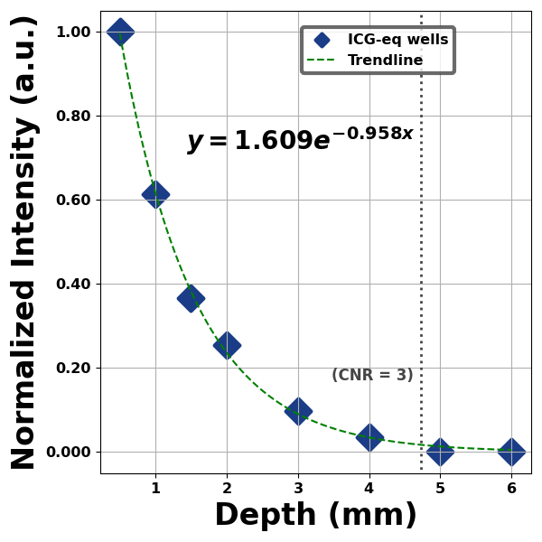
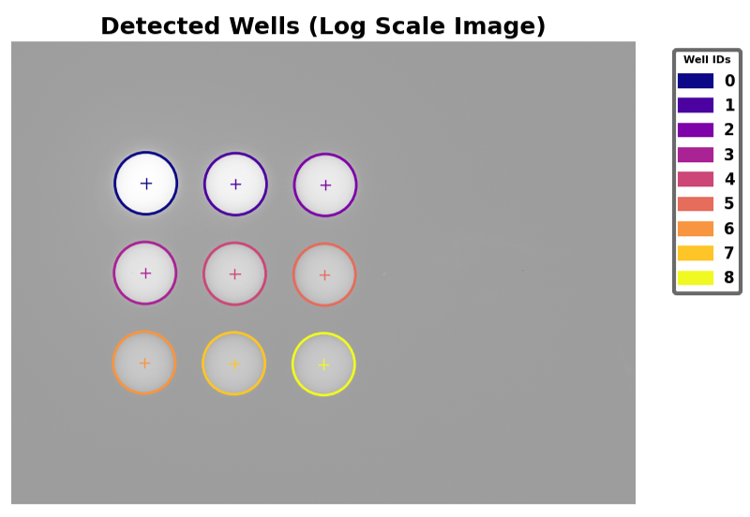
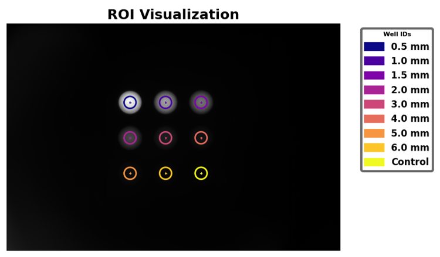
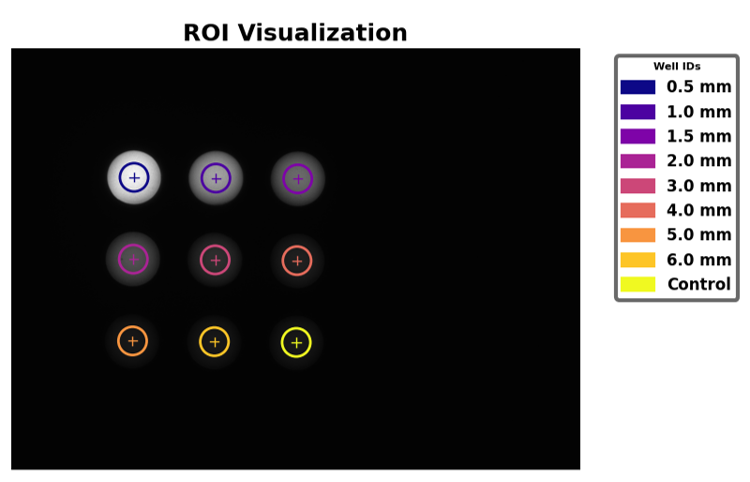
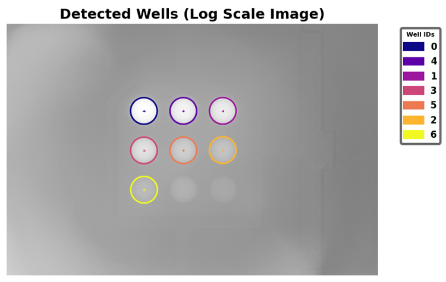
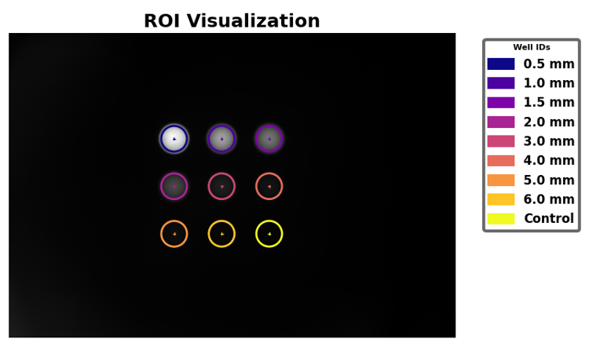
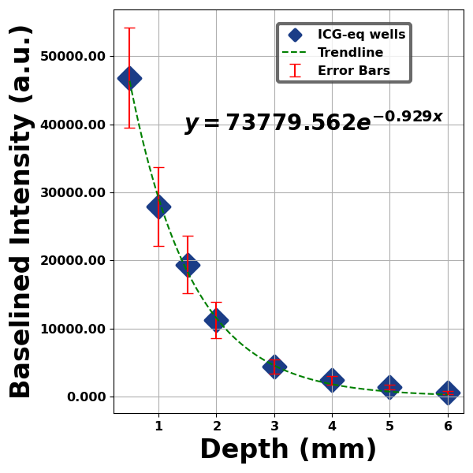

# Reference Depth Target Analysis
This document details analysis methods for QUEL Imaging's reference depth sensitivity (RDS) target using the qal library. At a high level, the document is structured into four sections: a brief description of the target, followed by a "quick start" section showing basic use of the code, then a more detailed overview of how the code works, and finally, some examples.

<br/>

# Target Description
The RDS target consists of nine wells of fluorescent material buried beneath varying thicknesses of non-fluorescent tissue-mimicking material, all embedded within a non-fluorescent and light-absorbing mold. It enables probing the fluorescence depth sensitivity of an imaging system. See the use guide (available here: https://shop.quelimaging.com/resources/) for more information on the target, including imaging recommendations.

<br/>

# Quick Start
Below is a block of code that can be used to analyze an image of the RDS target. It assumes the fluorophore in the depth target is "ICG-equivalent" and labels it as such. For a different fluorophore, change `fluorophore_label` in the last line (this only affects labeling on the plot). In addition to using the qal library, the code uses the scikit-image library (https://scikit-image.org/) to read in the image.
```python
from skimage import io
from qal.data import depth_sample_1
from qal import WellDetector, WellAnalyzer, WellPlotter

depth_im = io.imread('***replace-with-path-to-your-image***')
# Uncomment the line below to use our example image instead
# depth_im = depth_sample_1()

detector = WellDetector()
detector.detect_wells(depth_im)
depth_df = detector.estimate_remaining_wells_3x3(
    depth_im, 
    detector.df,
    well_ids=['0.5 mm', '1.0 mm', '1.5 mm', '2.0 mm', '3.0 mm', '4.0 mm', '5.0 mm', '6.0 mm', 'Control']
)

analyzer = WellAnalyzer(depth_im, depth_df)
depth_df = analyzer.get_stats()

plotter = WellPlotter(depth_df)
plotter.plot(graph_type='depth', col_to_plot='mean intensity normalized', fluorophore_label='ICG-eq',
             trendline_lib='scipy')
```
Running the code will produce a figure like the one below. On the y-axis is the normalized intensity of the wells, plotted against depth of the fluorescent material on the x-axis. If present, the depth at which contrast-to-noise ratio (CNR) reaches 3 is indicated.
<p align="center">

</p>

Additionally, a message will be printed to the screen concerning the depth at which CNR reaches 3, e.g.:
```
CNR falls below 3 at 4.7 mm on the fitted curve.
```
Continue reading for a better understanding of the code and how to use it.

<br/>

# Methodology
Analyzing an image of the RDS target involves a three-step process of:
* Identifying, localizing, and quantifying average intensities of fluorescent wells
* Data processing - Intensity normalization and contrast-to-noise calculation
* Visualization of results

<br/>

## Step 1 - Well identification, localization, and quantification
This step is accomplished using the `WellDetector` class. Note that by default, `WellDetector` uses parallel processing to speed up the detection of wells, which for a large image, can take a long time otherwise. For smaller images, the overhead involved with setting up parallel processing might make it less efficient than single thread processing. To disable parallel processing for a `WellDetector` object, set the `parallel_processing` attribute to `False` during initialization:
```python
detector = WellDetector(parallel_processing=False)
```

Two methods are used sequentially to obtain a dataframe containing information on the nine wells, including their centroid locations and average intensities. The first is `detect_wells()`, which identifies as many fluorescent wells as it can, based on their intensity. Often this may not be sufficient to identify all nine wells, so the second method, `estimate_remaining_wells_3x3()` is needed. This uses the already identified well positions and knowledge of the physical dimensions of the RDS target to estimate the locations of any remaining wells.

In its simplest form, the code for well identification for an RDS target looks like the following (where `depth_im` is an image of the RDS target):
```python
detector = WellDetector()
detector.detect_wells(depth_im)
depth_df = detector.estimate_remaining_wells_3x3(
    depth_im, 
    detector.df,
    well_ids=['0.5 mm', '1.0 mm', '1.5 mm', '2.0 mm', '3.0 mm', '4.0 mm', '5.0 mm', '6.0 mm', 'Control']
)
```

The `detect_wells()` method takes an image of the RDS target (provided as a 2D array) as input. It also has four other optional inputs that can be provided in the function call. All inputs are defined below:
<table>
<tr>
<td width="25%" align="right" valign="top">
im
</td>
<td width="75%">
<i>Required</i>. A 2D array containing an image of the RDS target.
</td>
</tr>
<tr>
<td width="25%" align="right" valign="top">
well_ids
</td>
<td width="75%">
<i>Optional</i>. A list of IDs for the fluorescent wells. For RDS targets, the well IDs will generally be <code>['0.5 mm', '1.0 mm', '1.5 mm', '2.0 mm', '3.0 mm', '4.0 mm', '5.0 mm', '6.0 mm', 'Control']</code>. By default, this is <code>None</code>. Note, it is also provided in the <code>estimate_remaining_wells_3x3()</code> method.
</td>
</tr>
<tr>
<td width="25%" align="right" valign="top">
show_detected_wells
</td>
<td width="75%">
<i>Optional</i>. Whether to display a figure showing the wells that were identified. Default is <code>False</code>.
</td>
</tr>
<tr>
<td width="25%" align="right" valign="top">
debug
</td>
<td width="75%">
<i>Optional</i>. If <code>True</code>, a figure is displayed that can help with debugging well-identification. Default is <code>False</code>.
</td>
</tr>
<tr>
<td width="25%" align="right" valign="top">
set_consistent_roi_region
</td>
<td width="75%">
<i>Optional</i>. If <code>True</code>, the ROIs within which average fluorescence intensity is calculated will have the same radius (otherwise the size of each ROI depends on the size of the region identified). Note that in <code>estimate_remaining_wells_3x3()</code>, all ROIs will be set to have the same radius. Default is <code>False</code>.
</td>
</tr>
<tr>
<td width="25%" align="right" valign="top">
downscale
</td>
<td width="75%">
<i>Optional</i>. An alternative to parallel processing to improve speed. Setting <code>downscale=0.5</code> means that the input image will be rescaled by a factor of one half before performing well detection. Since this step is only used to find the locations of the wells, it should not significantly alter results (subsequent analysis is still performed on the full resolution image). Default is <code>1</code>.
</td>
</tr>
</table>

The output of `detect_wells()` is a dataframe containing identified wells. This dataframe is also contained within the `df` attribute of the `WellDetector` instance. Assuming `depth_im` is an image of the RDS target, the dataframe can be obtained with:
```python
detector = WellDetector()
depth_df = detector.detect_wells(depth_im)
```
Or,
```python
detector = WellDetector()
detector.detect_wells(depth_im)
depth_df = detector.df
```

<br/>The `estimate_remaining_wells_3x3()` method takes in the same image of the RDS target as input, as well as the dataframe produced by the `detect_wells()` method. It also has two optional inputs. All inputs are defined below:
<table>
<tr>
<td width="25%" align="right" valign="top">
im
</td>
<td width="75%">
<i>Required</i>. A 2D array containing an image of the RDS target. This should be the same image supplied to <code>detect_wells()</code>.
</td>
</tr>
<tr>
<td width="25%" align="right" valign="top">
df
</td>
<td width="75%">
<i>Required</i>. A dataframe containing the wells identified by <code>detect_wells()</code>. If <code>detector</code> is an instance of <code>WellDetector</code>, then after running the <code>detect_wells()</code> method, the needed dataframe will be contained within <code>detector.df</code>.
</td>
</tr>
<tr>
<td width="25%" align="right" valign="top">
well_ids
</td>
<td width="75%">
<i>Optional</i>. A list of IDs for the fluorescent wells. For RDS targets, the well IDs will generally be <code>['0.5 mm', '1.0 mm', '1.5 mm', '2.0 mm', '3.0 mm', '4.0 mm', '5.0 mm', '6.0 mm', 'Control']</code>. Default is <code>None</code>.
</td>
</tr>
<tr>
<td width="25%" align="right" valign="top">
show_detected_wells
</td>
<td width="75%">
<i>Optional</i>. Whether to display a figure showing the wells that were identified. Default is <code>False</code>.
</td>
</tr>
</table>

The output of this method is a dataframe that contains all nine wells. The dataframe will also be contained within the `df` attribute of the `WellDetector` instance. It will look like the following:
```
            x           y  ROI Diameter  ROI Radius     well  value
0  280.227064  294.690975    129.333333   64.666667   0.5 mm    0.5
1  467.291596  296.399231    129.333333   64.666667   1.0 mm    1.0
2  654.356128  298.107487    129.333333   64.666667   1.5 mm    1.5
3  278.518808  481.755507    129.333333   64.666667   2.0 mm    2.0
4  465.583340  483.463763    129.333333   64.666667   3.0 mm    3.0
5  652.647872  485.172019    129.333333   64.666667   4.0 mm    4.0
6  276.810552  668.820040    129.333333   64.666667   5.0 mm    5.0
7  463.875084  670.528296    129.333333   64.666667   6.0 mm    6.0
8  650.939617  672.236551    129.333333   64.666667  Control    0.0
```
An example of calling this method with the optional input of showing the detected wells is as follows:
```python
depth_df = detector.estimate_remaining_wells_3x3(
    depth_im, 
    depth_df,
    well_ids=['0.5 mm', '1.0 mm', '1.5 mm', '2.0 mm', '3.0 mm', '4.0 mm', '5.0 mm', '6.0 mm', 'Control'],
    show_detected_wells=True
)
```
In addition to outputting the complete dataframe, this will produce a figure like the one below, showing a log-scale image of the identified wells with numbered IDs ordered from highest to lowest fluorescence intensity:
<p align="center">

</p>
<br/>

## Step 2 - Data processing
This step is accomplished by using the `WellAnalyzer` class. `WellAnalyzer` must be initialized with two inputs. They are:
<table>
<tr>
<td width="25%" align="right" valign="top">
im
</td>
<td width="75%">
A 2D array representing an image of the RDS target. This should be the same image used in the first step.
</td>
</tr>
<tr>
<td width="25%" align="right" valign="top">
df
</td>
<td width="75%">
A dataframe containing the wells identified in the first step. This will be the output from calling <code>estimate_remaining_wells_3x3()</code>.
</td>
</tr>
</table>

Then, data is processed using the `get_stats()` method of `WellAnalyzer`. As the name implies, `get_stats()` simply calculates relevant statistics about the image of the RDS target. These are then used in the final step to visualize results. Given an image of the RDS target called `depth_im`, and the output from Step 1 called `depth_df`, obtaining statistics goes as follows:
```python
analyzer = WellAnalyzer(depth_im, depth_df)
depth_df = analyzer.get_stats()
```
`get_stats()` has one optional input, `region_of_well_to_analyze`, that is the fraction of the well's diameter for which to calculate statistics. By default, this is `0.5` (recommended).


The output of the `get_stats()` method is also a dataframe which now contains additional statistics about the nine wells, including normalized intensity and contrast-to-noise ratio (CNR). It will look like this:
```
            x           y  ROI Diameter  ROI Radius     well  value  Analyzed ROI Diameter  mean intensity  standard deviation  mean intensity baselined  mean intensity normalized  standard deviation normalized         CNR
0  280.227064  294.690975    129.333333   64.666667   0.5 mm    0.5              64.666667        1.182437            0.049110                  1.082754                   1.000000                       0.064660  173.314025
1  467.291596  296.399231    129.333333   64.666667   1.0 mm    1.0              64.666667        0.763174            0.046794                  0.663492                   0.613129                       0.051827  106.203610
2  654.356128  298.107487    129.333333   64.666667   1.5 mm    1.5              64.666667        0.496486            0.027279                  0.396803                   0.367045                       0.030802   63.515392
3  278.518808  481.755507    129.333333   64.666667   2.0 mm    2.0              64.666667        0.374364            0.021615                  0.274682                   0.254358                       0.023798   43.967683
4  465.583340  483.463763    129.333333   64.666667   3.0 mm    3.0              64.666667        0.204223            0.012571                  0.104541                   0.097362                       0.013696   16.733587
5  652.647872  485.172019    129.333333   64.666667   4.0 mm    4.0              64.666667        0.137234            0.008861                  0.037551                   0.035548                       0.010138    6.010715
6  276.810552  668.820040    129.333333   64.666667   5.0 mm    5.0              64.666667        0.098709            0.006516                 -0.000973                   0.000000                       0.008337   -0.155788
7  463.875084  670.528296    129.333333   64.666667   6.0 mm    6.0              64.666667        0.100939            0.006312                  0.001256                   0.002057                       0.008203    0.201108
8  650.939617  672.236551    129.333333   64.666667  Control    0.0              64.666667        0.099683            0.006247                  0.000000                   0.000898                            NaN    0.000000
```
<br/>

## Step 3 - Visualization
This final visualization step involves calling the `plot()` method of the `WellPlotter` class. This will plot relevant data (e.g., normalized mean intensity) versus depth. A `WellPlotter` object must be initialized with a dataframe containing statistics about the nine wells of the RDS target - i.e., the output from calling the `get_stats()` method of `WellAnalyzer`. For example, if `depth_df` is the dataframe containing well statistics, create a `WellPlotter` object as:
```python
plotter = WellPlotter(depth_df)
```
`WellPlotter` can additionally be initialized with the image of the depth target. This form of initialization is recommended if intending to use the `visualize_roi()` method (discussed later):
```python
plotter = WellPlotter(depth_df, image=depth_im)
```

The `plot()` method, used to display analysis results, has six optional inputs that can be defined:
<table>
<tr>
<td width="25%" align="right" valign="top">
graph_type
</td>
<td width="75%">
A string indicating the type of target that is being analyzed. Options are <code>'concentration'</code> for RCS targets, and <code>'depth'</code> for RDS targets. Default is <code>'concentration'</code>.
</td>
</tr>
<tr>
<td width="25%" align="right" valign="top">
col_to_plot
</td>
<td width="75%">
A string indicating the column of the input dataframe to plot. Note that not all columns of the dataframe make sense to plot. It is recommended to plot <code>'mean intensity normalized'</code>, which is the average intensity of the wells normalized between 0 and 1 after subtracting the average intensity of the control well. Default is <code>'mean intensity'</code>.
</td>
</tr>
<tr>
<td width="25%" align="right" valign="top">
fluorophore_label
</td>
<td width="75%">
A string indicating the fluorophore name that should be used in labeling the plot. This is only used in labeling and does not affect anything else. By default, this is <code>'ICG-eq'</code>, for ICG-equivalent fluorophore.
</td>
</tr>
<tr>
<td width="25%" align="right" valign="top">
plot_error_bars
</td>
<td width="75%">
Whether to add error bars to the plot. Default is <code>False</code>.
</td>
</tr>
<tr>
<td width="25%" align="right" valign="top">
trendline_lib
</td>
<td width="75%">
A string determining what method is used to plot a trendline. Use <code>'statsmodels'</code> for RCS targets, and <code>'scipy'</code> for RDS targets. Default is <code>'statsmodels'</code>.
</td>
</tr>
<tr>
<td width="25%" align="right" valign="top">
save_plot
</td>
<td width="75%">
If provided, the path (directory + filename) to which to save the plot. Default is <code>None</code>.
</td>
</tr>
<tr>
<td width="25%" align="right" valign="top">
cnr_threshold
</td>
<td width="75%">
If provided for RDS targets, the CNR value to use in defining the depth detection limit line. The recommended and default value is <code>3</code>.
</td>
</tr>
</table>

Then, the recommended way to visualize analysis results for an RDS target is:
```python
save_path = '***replace-with-desired-file-path***'      # Or, skip this line if not saving
fluor_label = '***replace-with-fluorophore-name***'
plotter.plot(graph_type='depth', col_to_plot='mean intensity normalized', fluorophore_label=fluor_label,
             trendline_lib='scipy', save_plot=save_path)
```

<br/>`WellPlotter` additionally has a method to visualize the ROIs that were used in calculating results. This is `visualize_roi()`. In order to use this method, the `WellPlotter` object must contain the image that was analyzed - this can be done either in the initialization, as mentioned above, or by assigning the image to the `image` attribute of the `WellPlotter` object, e.g., `plotter.image = depth_im`. It has one optional input, which is the Matplotlib colormap for the displayed ROIs (Default is `'plasma'`). Visualize the ROIs using:
```python
plotter.visualize_roi()
```
A figure like the following will be produced:
<p align="center">

</p>
<br/>

# Examples

## Normalized depth sensitivity curve
This example processes an image of the RDS target to produce a plot of the normalized mean well intensity versus depth. The image used is downloaded from the repository but can also be located at: **qal/data/depth_targets/depth_sample_1.tiff**. First, the necessary modules are imported:
```python
import pandas as pd
from qal.data import depth_sample_1
from qal import WellDetector, WellAnalyzer, WellPlotter
```
Next, the image is read in and analyzed to localize and quantify the fluorescent wells:
```python
depth_im = depth_sample_1()

detector = WellDetector()
detector.detect_wells(depth_im)
depth_df = detector.estimate_remaining_wells_3x3(
    depth_im, 
    detector.df,
    well_ids=['0.5 mm', '1.0 mm', '1.5 mm', '2.0 mm', '3.0 mm', '4.0 mm', '5.0 mm', '6.0 mm', 'Control']
)
```
Then, the data is analyzed and the dataframe containing well statistics is printed to the screen:
```python
analyzer = WellAnalyzer(depth_im, depth_df)
depth_df = analyzer.get_stats()

with pd.option_context('display.max_rows', None, 'display.max_columns', None):
    print(depth_df)
```

Finally, the ROIs used for analysis are displayed, as well as the resulting normalized well intensities versus depth. This target has ICG-equivalent fluorophore in the wells:
```python
plotter = WellPlotter(depth_df, image=depth_im)
plotter.visualize_roi()
plotter.plot(graph_type='depth', col_to_plot='mean intensity normalized', fluorophore_label='ICG-eq',
             trendline_lib='scipy')
```
When executed, the following dataframe will be printed to the screen:
```
            x           y  ROI Diameter  ROI Radius     well  value  Analyzed ROI Diameter  mean intensity  standard deviation  mean intensity baselined  mean intensity normalized  standard deviation normalized         CNR
0  280.227064  294.690975    129.333333   64.666667   0.5 mm    0.5              64.666667        1.182437            0.049110                  1.082754                   1.000000                       0.064660  173.314025
1  467.291596  296.399231    129.333333   64.666667   1.0 mm    1.0              64.666667        0.763174            0.046794                  0.663492                   0.613129                       0.051827  106.203610
2  654.356128  298.107487    129.333333   64.666667   1.5 mm    1.5              64.666667        0.496486            0.027279                  0.396803                   0.367045                       0.030802   63.515392
3  278.518808  481.755507    129.333333   64.666667   2.0 mm    2.0              64.666667        0.374364            0.021615                  0.274682                   0.254358                       0.023798   43.967683
4  465.583340  483.463763    129.333333   64.666667   3.0 mm    3.0              64.666667        0.204223            0.012571                  0.104541                   0.097362                       0.013696   16.733587
5  652.647872  485.172019    129.333333   64.666667   4.0 mm    4.0              64.666667        0.137234            0.008861                  0.037551                   0.035548                       0.010138    6.010715
6  276.810552  668.820040    129.333333   64.666667   5.0 mm    5.0              64.666667        0.098709            0.006516                 -0.000973                   0.000000                       0.008337   -0.155788
7  463.875084  670.528296    129.333333   64.666667   6.0 mm    6.0              64.666667        0.100939            0.006312                  0.001256                   0.002057                       0.008203    0.201108
8  650.939617  672.236551    129.333333   64.666667  Control    0.0              64.666667        0.099683            0.006247                  0.000000                   0.000898                            NaN    0.000000
```

And the following figures will be displayed, first showing the analyzed ROIs, and second showing the normalized fluorescence intensity versus depth:
<p align="center">

</p>
<p align="center">

</p>

Additionally, the following will be printed to the screen, identifying a depth of 4.7 mm as where CNR reaches 3:
```
CNR falls below 3 at 4.7 mm on the fitted curve.
```
<br/>

## Depth sensitivity curve with error bars
This example processes an image of the RDS target to produce a plot of baselined (i.e., mean intensity of control well subtracted) mean well intensity with error bars. The image used is located in the repository at: **qal/data/depth_targets/depth_sample_2.tiff**. Imports and reading in the image are similar to the first example:
```python
from qal.data import depth_sample_2
from qal import WellDetector, WellAnalyzer, WellPlotter

depth_im = depth_sample_2()
```
Next, well detection is performed, this time with the addition of displaying the detected wells from the `detect_wells()` call:
```python
detector = WellDetector()
detector.detect_wells(depth_im, show_detected_wells=True)
depth_df = detector.estimate_remaining_wells_3x3(
    depth_im, 
    detector.df,
    well_ids=['0.5 mm', '1.0 mm', '1.5 mm', '2.0 mm', '3.0 mm', '4.0 mm', '5.0 mm', '6.0 mm', 'Control']
)
```
In this example, data is analyzed over ROIs that are 80% of the diameter of the wells:
```python
analyzer = WellAnalyzer(depth_im, depth_df)
depth_df = analyzer.get_stats(region_of_well_to_analyze=0.8)
```
Finally, the analyzed ROIs are visualized and baselined mean intensity is plotted with error bars:
```python
plotter = WellPlotter(depth_df, image=depth_im)
plotter.visualize_roi()
plotter.plot(graph_type='depth', col_to_plot='mean intensity baselined', fluorophore_label='ICG-eq',
             plot_error_bars=True, trendline_lib='scipy')
```
When the code is executed, the following figure is first displayed, showing seven detected wells out of nine from the `detect_wells()` call, and showcasing the need for subsequently calling the `estimate_remaining_wells_3x3()` method:
<p align="center">

</p>

Close that figure and the next to be displayed shows the input image overlaid with the ROIs used for analysis. Note how these are larger than in the previous example:
<p align="center">

</p>

Close this figure and the depth plot will be displayed next:
<p align="center">

</p>

Additionally, the following will be printed to the screen:
```
CNR is above 3 for all data.
```