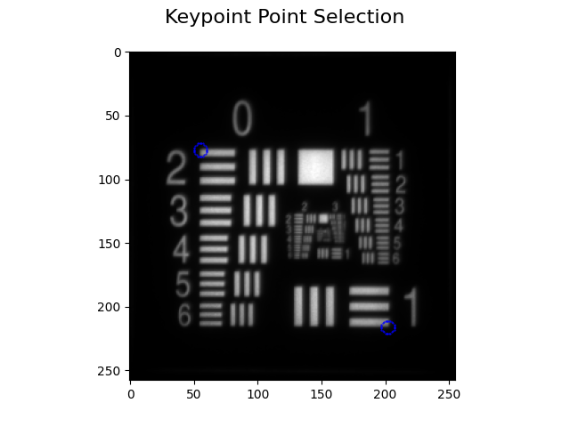
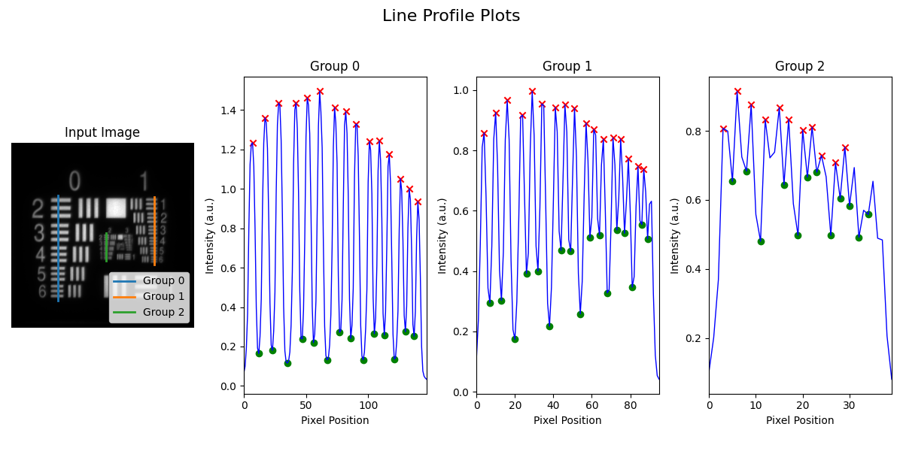
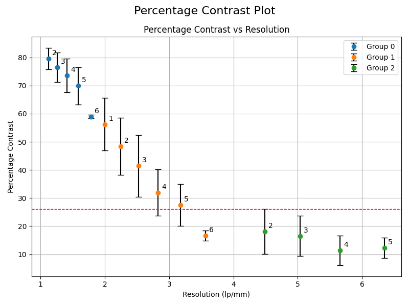
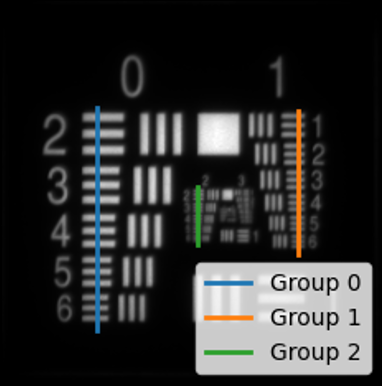
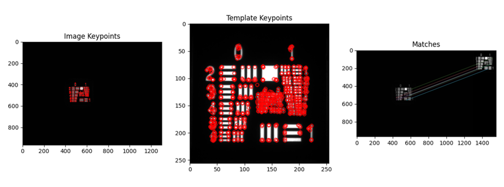
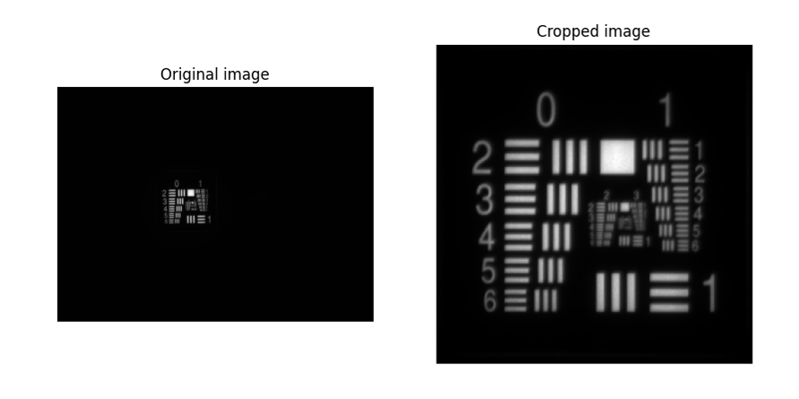
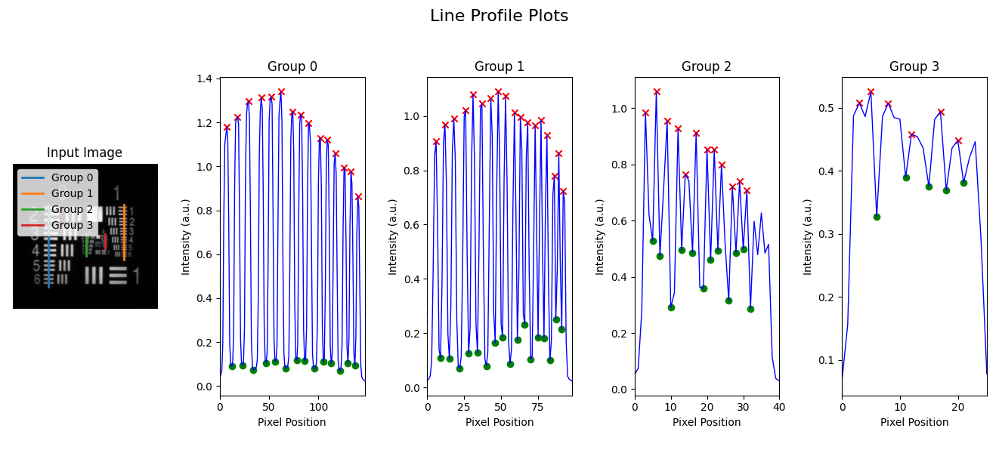
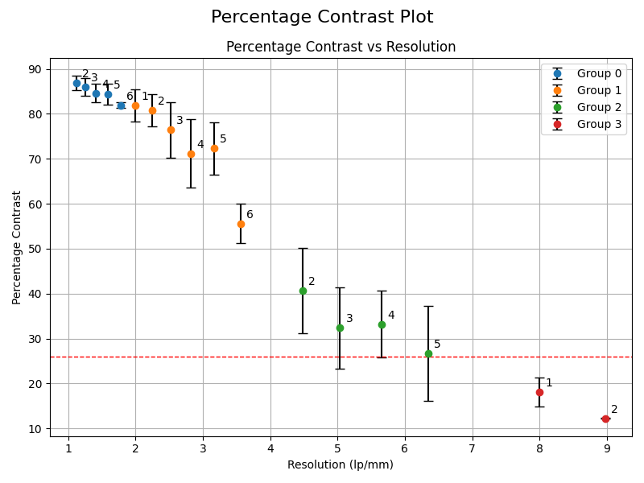

# Reference Resolution Target Analysis   
This document details analysis methods for QUEL Imaging's reference resolution (RRT) target using the qal library. At a high level, the document is structured into four sections: a brief description of the target, followed by a "quick start" section showing basic use of the code, then a more detailed overview of how the code works, and finally, some examples.

# <br/>Target Description   
The RRT target consists of a negative 1951 USAF resolution test chart with a fluorescent backing. It allows assessing the fluorescence resolution capability of an imaging system. See the use guide (available here: https://shop.quelimaging.com/resources/) for more information on the target, including imaging recommendations.

# <br/>Quick Start   
Use the following block of code to analyze an image of the RRT target and produce a plot of contrast versus spatial resolution. In addition to using the qal library, the code uses the scikit-image library (https://scikit-image.org/) to read in the image.
```python
from skimage import io
from qal import RrtROI, RrtAnalyzer, RrtDataPlotter

image = io.imread('***replace-with-path-to-your-image***')

rrt_roi = RrtROI()
cropped_image = rrt_roi.get_resolution_target_cropped(image)
rrt_roi.select_points_standard(cropped_image)
group_coordinates = rrt_roi.group_coordinates

analyzer = RrtAnalyzer()
percentage_contrast_df = analyzer.load_and_process_groups(cropped_image, group_coordinates)

visualizer = RrtDataPlotter()
visualizer.plot_line_profiles(cropped_image, group_coordinates, percentage_contrast_df)
visualizer.plot_percentage_contrast(percentage_contrast_df)
```
Upon executing this code, a cropped image of the resolution target will be displayed and text will be printed to the command line, requesting that the user click on points in the image:
```
Please make the following selections. 
1: Upper left corner of Group 0 Element 2 
2: Bottom right corner of Group 0 Element 1
```
After point selection, the figure will update to show the detected corners of the resolution pattern. Close this figure to continue.
<p align="center">

</p>

The next figure to be displayed contains the line profiles that were used to calculate contrast:
<p align="center">

</p>

Finally, the contrast (modulation) is displayed. This figure includes a horizontal dashed red line indicating the resolution limit as where the contrast falls below 26%:
<p align="center">

</p>

Continue reading for an understanding of the code and how to use it.

# <br/>Methodology   
Analysis of the RRT target consists of three steps. These are:
* ROI selection
* Contrast calculation
* Visualization of results

## <br/>Step 1 - ROI selection
ROI selection for the RRT target involves taking line profiles along the horizontally-oriented bars of the target, as shown in the image below. A limitation of this method is that it only assesses resolution in the axis perpendicular to the bars, and an imaging system could have different resolution horizontally versus vertically (if that is the case, consider taking a second image of the RRT target rotated by 90°).
<p align="center">

</p>

There are two methods to obtain these line profiles: (1) in a semi-automated fashion using the `RrtROI` class, and (2) manually by entering coordinates. Both methods are described below.

### Semi-automated ROI selection
Using the `RrtROI` class, line profiles can be obtained in a semi-automated fashion for three groups of the resolution chart: groups 0, 1, and 2 (these are the lines shown in the figure above). This method involves first cropping and aligning the image of the RRT target to an internal reference, using the `get_resolution_target_cropped()` method, and then obtaining the endpoints of the three line profiles, using the `select_points_standard()` method.

The `get_resolution_target_cropped()` method takes the input image of the resolution target and aligns it to an internal reference image of the resolution test chart pattern. It returns the aligned and cropped image for subsequent analysis. Its inputs are defined below:
<table>
<tr>
<td width="25%" align="right" valign="top">
im_src
</td>
<td width="75%">
<i>Required</i>. A 2D array containing an image of the RRT target.
</td>
</tr>
<tr>
<td width="25%" align="right" valign="top">
show_kp
</td>
<td width="75%">
<i>Optional</i>. Whether to display the keypoints used in pattern matching. If <code>True</code>, a figure is displayed showing the identified keypoints in the input image, the keypoints from the reference image, and the matching between the two. Default is <code>False</code>.
</td>
</tr>
<tr>
<td width="25%" align="right" valign="top">
min_good_matches
</td>
<td width="75%">
<i>Optional</i>. The minimum number of matches acceptable for detecting the RRT target in an input image. It is recommended to not change this parameter. Default is <code>10</code>.
</td>
</tr>
<tr>
<td width="25%" align="right" valign="top">
min_kp_dist_threshold
</td>
<td width="75%">
<i>Optional</i>. A distance threshold for use in identifying good matches in pattern matching. Values closer to 0 filter more matches. It is recommended to not change this parameter. Default is <code>0.45</code>.
</td>
</tr>
<tr>
<td width="25%" align="right" valign="top">
save_cropped_im
</td>
<td width="75%">
<i>Optional</i>. If provided, the path (with or without an extension) to save the cropped resolution target image. The image is saved as a TIFF file if no extension is specified. Default is <code>None</code>, meaning the image is not saved.
</td>
</tr>
</table>

If analysis of an image of the RRT target produces unexpected results, observing the pattern matching is a good first check to make sure the target is being correctly identified. For an input 2D array image called `image`:
```python
rrt_roi = RrtROI()
cropped_image = rrt_roi.get_resolution_target_cropped(image, show_kp=True)
```
This will produce a figure like the one below:
<p align="center">

</p>

The `select_points_standard()` method takes the aligned and cropped image, i.e., the output of the `get_resolution_target_cropped()` method, and prompts the user to select two corners of the resolution pattern to assist with obtaining line profiles for subsequent analysis. It only has the one input. For an aligned and cropped image named `cropped_image`,
```python
select_points_standard(cropped_image)
```
Upon calling this method, the cropped image is displayed and the following is printed to the screen:
```
Please make the following selections. 
1: Upper left corner of Group 0 Element 2 
2: Bottom right corner of Group 0 Element 1
```
When finished, the `group_coordinates` attribute of the `RrtROI` object will contain a dictionary with endpoints (pixel locations) for three line profiles going across Group 0, Group 1, and Group 2.

### Manual ROI selection
In some cases, the user may wish to manually provide endpoints of the line profiles for analysis. One possible scenario could be that the imaging system is well capable of resolving Groups 0, 1, and 2, which are the only Groups identified with the semi-automated method, and the user would like to additionally analyze Group 3. Another scenario could be that pattern matching using the semi-automated method is unsuccessful.

The manual method does not require the `RrtROI` class. It only requires specifying line profile endpoints in a Python dictionary. Each entry in the dictionary should have the form:
```
***Group number***: {'coordinates': ((***x-y-pixel-location-of-top***), (***x-y-pixel-location-of-bottom***)),
                     'elements': ***range-of-elements-spanned***}
```
An example is given below, where the endpoints are provided for line profiles spanning the horizontal bars of Groups 0 to 3:
```python
group_coordinates = {
    0: {'coordinates': ((64, 73), (64, 220)), 'elements': range(2, 7)},     # Group 0, Elements 2 through 6
    1: {'coordinates': ((199, 73), (199, 171)), 'elements': range(1, 7)},   # Group 1, Elements 1 through 6
    2: {'coordinates': ((131, 125), (131, 165)), 'elements': range(2, 7)},  # Group 2, Elements 2 through 6
    3: {'coordinates': ((165, 126), (165, 151)), 'elements': range(1, 7)}   # Group 3, Elements 1 through 6
}
```

## <br/>Step 2 - Contrast calculation
In this step, contrast is calculated using line profiles provided. Contrast is calculated as:

$$ Contrast (\\%) = {{{I_{peak} - I_{trough}} \over {I_{peak} + I_{trough}}} * 100} $$

where $I_{peak}$ is the intensity of a peak along the line profile, and $I_{trough}$ is the intensity of a trough along the line profile. The `load_and_process_groups()` method of the `RrtAnalyzer` class calculates contrast for the line profiles provided. It requires two inputs, the (cropped) image of the RRT target, and the line profiles to be analyzed. Say the input image is named `cropped_image`, and `group_coordinates` contains information on the line profiles, obtain contrast using:
```python
analyzer = RrtAnalyzer()
percentage_contrast_df = analyzer.load_and process_groups(cropped_image, group_coordinates)
```
The output will be a dataframe that looks like the following:
```
    Group  Element  Resolution (lp/mm)  Line Width (microns)  Percentage Contrast  Percentage Contrast Std     Peak Indices   Trough Indices
0       0        2            1.122462                445.45            87.053581                 1.584939      [8, 19, 30]     [13, 24, 36]
1       0        3            1.259921                396.85            85.991051                 1.954597     [43, 52, 63]     [48, 58, 68]
2       0        4            1.414214                353.55            84.327156                 2.218656     [75, 83, 92]     [79, 88, 97]
3       0        5            1.587401                314.98            82.977661                 3.235596  [103, 110, 118]  [107, 114, 123]
4       0        6            1.781797                280.62            79.815170                 0.529114  [128, 134, 141]       [131, 138]
5       1        1            2.000000                250.00            81.593788                 3.607717      [5, 11, 17]      [8, 14, 21]
6       1        2            2.244924                222.72            80.453758                 3.791615     [25, 30, 36]     [27, 33, 39]
7       1        3            2.519842                198.43            76.364128                 6.128937     [42, 47, 52]     [45, 50, 55]
8       1        4            2.828427                176.78            70.688057                 7.896383     [58, 62, 67]     [60, 65, 69]
9       1        5            3.174802                157.49            71.349907                 6.221506     [72, 76, 80]     [74, 78, 82]
10      1        6            3.563595                140.31            54.038887                 3.870470     [85, 88, 91]         [86, 90]
11      2        2            4.489848                111.36            37.544437                 8.677942       [4, 7, 10]       [6, 8, 11]
12      2        3            5.039684                 99.21            30.408937                 9.227140     [13, 15, 18]     [14, 17, 20]  
13      2        4            5.656854                 88.39            29.949408                 5.480946     [21, 23, 29]     [22, 24, 28]
14      2        5            6.349604                 78.75            24.296225                 9.130061     [31, 33, 37]     [30, 32, 34] 
15      2        6            7.127190                 70.15                  NaN                      NaN               []         [36, 38]
```
A common thing to look for is where the contrast reaches 26.4%, which determines the resolution limit of the imaging system based on the Rayleigh criterion. In the example data above, this is before Group 2, Element 5. Hence, the smallest resolvable feature is Group 2, Element 4, which has a resolution of 5.657 lp/mm.

## <br/>Step 3 - Visualization
Final visualization is done using the `RrtDataPlotter` class. This class has two methods for plotting. The first, `plot_line_profiles()`, displays the input image of the RRT target, overlaid with the line profiles used in analysis, as well as the intensity data from each of the line profiles. Inputs to to the method are defined below:
<table>
<tr>
<td width="25%" align="right" valign="top">
im
</td>
<td width="75%">
<i>Required</i>. A 2D array containing the input image of the RRT target.
</td>
</tr>
<tr>
<td width="25%" align="right" valign="top">
group_coordinates
</td>
<td width="75%">
<i>Required</i>. A dictionary containing information about the line profiles analyzed. This should be the same as the dictionary used in Step 2.
</td>
</tr>
<tr>
<td width="25%" align="right" valign="top">
percentage_contrast_df
</td>
<td width="75%">
<i>Required</i>. A dataframe containing analysis results. This is the output of the <code>load_and_process_groups()</code> method of <code>RrtAnalyzer</code>.
</td>
</tr>
</table>

Assuming the variable `cropped_image` is a (cropped) image of the RRT target, `group_coordinates` is a dictionary containing line profile information, and `percentage_contrast_df` is a dataframe containing analysis results, visualize the line profiles using:
```python
visualizer = RrtDataPlotter()
visualizer.plot_line_profiles(cropped_image, group_coordinates, percentage_contrast_df)
```
The second visualization method, `plot_percentage_contrast()`, plots the calculated contrast as a function of spatial resolution (in lp/mm). Its inputs are defined below:
<table>
<tr>
<td width="25%" align="right" valign="top">
df
</td>
<td width="75%">
<i>Required</i>. A dataframe containing analysis results. This is the output of the <code>load_and_process_groups()</code> method of <code>RrtAnalyzer</code>.
</td>
</tr>
<tr>
<td width="25%" align="right" valign="top">
resolution_threshold
</td>
<td width="75%">
<i>Optional</i>. The y-axis value for a horizontal dashed red line drawn on the plot to help indicate the resolution limit. Default is <code>26</code>, based on the Rayleigh criterion.
</td>
</tr>
</table>

Example use:
```python
visualizer = RrtDataPlotter()
visualizer.plot_percentage_contrast(percentage_contrast_df)
```

# <br/>Examples   

## Semi-automated example
This example uses the semi-automated process to analyze an image of the RRT target. The image used is downloaded from the repository but can also be found at: **qal/data/resolution_targets/res_sample_1.tiff**. First, the necessary modules are imported:
```python
import matplotlib.pyplot as plt
from qal.data import res_sample_1
from qal import RrtROI, RrtAnalyzer, RrtDataPlotter
```
The image is then read, and then aligned to the internal reference and cropped. To check this step, the cropped image is visualized next to the input image:
```python
image = res_sample_1()

rrt_roi = RrtROI()
cropped_image = rrt_roi.get_resolution_target_cropped(image)

fig, (ax1, ax2) = plt.subplots(nrows=1, ncols=2, figsize=(9, 6))
ax1.imshow(image, cmap='gray')
ax1.set_title('Original image')
ax1.set_axis_off()
ax2.imshow(cropped_image, cmap='gray')
ax2.set_title('Cropped image')
ax2.set_axis_off()
plt.show()
```
Next, the line profiles for analysis are obtained, and analysis is performed:
```python
rrt_roi.select_points_standard(cropped_image)
group_coordinates = rrt_roi.group_coordinates

analyzer = RrtAnalyzer()
percentage_contrast_df = analyzer.load_and_process_groups(cropped_image, group_coordinates)
```
Using 26% as a cutoff, the dataframe is inspected to determine the smallest resolvable feature:
```python
threshold = 26
above_threshold_data = percentage_contrast_df[percentage_contrast_df['Percentage Contrast'] >= threshold]

if above_threshold_data.empty:
    print("\nAll data points are below 26% contrast (no resolvable features).")
else:
    last_above_threshold = above_threshold_data.iloc[-1]
    lp_mm = last_above_threshold['Resolution (lp/mm)']
    group = last_above_threshold['Group']
    element = last_above_threshold['Element']
    print(f"\nSmallest feature resolved with a percentage contrast above 26%:")
    print(f"Resolution: {lp_mm:.2f} lp/mm")
    print(f"Group: {int(group)}")
    print(f"Element: {element}")
```
Finally, the line profiles and the contrast plot are visualized:
```python
visualizer = RrtDataPlotter()
visualizer.plot_line_profiles(cropped_image, group_coordinates, percentage_contrast_df)
visualizer.plot_percentage_contrast(percentage_contrast_df)
```
When the code is executed, the first figure to be displayed shows the input image of the RRT target, next to the cropped image:
<p align="center">

</p>

After closing this figure, a second figure showing just the cropped image is displayed, and the user is prompted to click on the top left and bottom right of the resolution pattern. After making selections and closing this figure, the following will be printed to the screen, identifying the smallest resolvable feature as Group 1, Element 5, with a spatial resolution of 3.17 lp/mm:
```
Smallest feature resolved with a percentage contrast above 26%:
Resolution: 3.17 lp/mm
Group: 1
Element: 5
```
Finally, the line profiles are displayed, followed by the plot of contrast versus spatial resolution:
<p align="center">

</p>

<p align="center">

</p>

## Manual example
This example uses the manual process to define line profiles for analysis. Line profiles are defined for Groups 0 through 3 of the resolution pattern. The image used in this example is downloaded but can also be located in the repository at: **qal/data/resolution_targets/resolution_target_cropped.tiff**. First, the necessary modules are imported (note that this does not include the `RrtROI` class since it is not needed):
```python
import pandas as pd
from qal.data import resolution_target_cropped
from qal import RrtAnalyzer, RrtDataPlotter
```
The image is read, and then the endpoints of the line profiles are defined:
```python
image = resolution_target_cropped()

group_coordinates = {
    0: {'coordinates': ((64, 73), (64, 220)), 'elements': range(2, 7)},     # Group 0, Elements 2 through 6
    1: {'coordinates': ((199, 73), (199, 171)), 'elements': range(1, 7)},   # Group 1, Elements 1 through 6
    2: {'coordinates': ((131, 125), (131, 165)), 'elements': range(2, 7)},  # Group 2, Elements 2 through 6
    3: {'coordinates': ((165, 126), (165, 151)), 'elements': range(1, 7)}   # Group 3, Elements 1 through 6
}
```
The image is analyzed and the resulting dataframe printed to the screen:
```python
analyzer = RrtAnalyzer()
percentage_contrast_df = analyzer.load_and_process_groups(image, group_coordinates)

with pd.option_context('display.max_rows', None, 'display.max_columns', None):
        print(percentage_contrast_df)
```
Finally, the results are visualized:
```python
visualizer = RrtDataPlotter()
visualizer.plot_line_profiles(image, group_coordinates, percentage_contrast_df)
visualizer.plot_percentage_contrast(percentage_contrast_df)
```
The dataframe printed to the screen when this code is run includes data on Groups 0, 1, 2, and 3, and looks like the following:
```
    Group  Element  Resolution (lp/mm)  Line Width (microns)  Percentage Contrast  Percentage Contrast Std     Peak Indices   Trough Indices
0       0        2            1.122462                445.45            86.938560                 1.602026      [7, 18, 29]     [12, 23, 34]
1       0        3            1.259921                396.85            85.950005                 1.954987     [42, 52, 62]     [47, 56, 67]
2       0        4            1.414214                353.55            84.576813                 2.085982     [74, 82, 90]     [78, 86, 96]
3       0        5            1.587401                314.98            84.341774                 2.383827  [102, 109, 117]  [105, 113, 122]
4       0        6            1.781797                280.62            81.898956                 0.619259  [126, 133, 140]       [130, 137]
5       1        1            2.000000                250.00            81.856514                 3.517975      [6, 12, 18]      [9, 15, 22]
6       1        2            2.244924                222.72            80.823372                 3.543796     [26, 31, 37]     [28, 34, 40]
7       1        3            2.519842                198.43            76.426025                 6.128524     [43, 48, 53]     [46, 51, 56]
8       1        4            2.828427                176.78            71.123802                 7.596395     [59, 63, 68]     [61, 66, 70]
9       1        5            3.174802                157.49            72.317726                 5.812780     [73, 77, 81]     [75, 79, 83]
10      1        6            3.563595                140.31            55.586235                 4.380354     [86, 89, 92]         [87, 91]
11      2        2            4.489848                111.36            40.641075                 9.523232        [3, 6, 9]       [5, 7, 10]
12      2        3            5.039684                 99.21            32.341190                 9.019763     [12, 14, 17]     [13, 16, 19]
13      2        4            5.656854                 88.39            33.196377                 7.375069     [20, 22, 24]     [21, 23, 26]
14      2        5            6.349604                 78.75            26.699760                10.551686     [27, 29, 31]     [28, 30, 32]
15      2        6            7.127190                 70.15                  NaN                      NaN               []         [34, 36]
16      3        1            8.000000                 62.50            18.117685                 3.206548        [3, 5, 8]      [6, 11, 15]
17      3        2            8.979696                 55.68            12.225079                 0.115636     [12, 17, 20]         [18, 21]
18      3        3           10.079368                 49.61                  NaN                      NaN             [23]               []
19      3        4           11.313708                 44.19                  NaN                      NaN               []               []
20      3        5           12.699208                 39.37                  NaN                      NaN               []               []
21      3        6           14.254379                 35.08                  NaN                      NaN               []               []
```
The line profiles are displayed:
<p align="center">

</p>

And finally, the plot of contrast versus spatial resolution:
<p align="center">

</p>
