# Reference Uniformity and Distortion Target Analysis   
This document details analysis methods for QUEL Imaging's reference uniformity and distortion (RUD) target using the qal library. At a high level, the document is structured into three parts: a brief description of the target, followed by analysis for fluorescence uniformity with examples, and finally, analysis for local geometric distortion with examples.

# <br/>Target Description   
The RUD target consists of a grid of fluorescent wells on a square background of non-fluorescent material. It allows characterization of an imaging system's fluorescence uniformity and local geometric distortion. See the use guide for more information on the target, including imaging recommendations.   
   
# <br/>Uniformity Analysis   
## Quick Start
The following block of code can be used to obtain fluorescence uniformity profiles from well-taken images (see the RUD use guide) on a reasonably-uniform imaging system. The outputs will be stored a subfolder called "Surface Representation" created within the input data folder. The input folder must contain images of the same size. Continue reading this document for an understanding of the process and how to adapt it.
```python
from qal import RudDetector, UniformityAnalyzer, UniformityVisualizer

image_dir = "***Replace-with-path-to-your-image-directory***"

detector = RudDetector()
detector.detect_dots_uniformity(image_dir)

analyzer = UniformityAnalyzer()
analyzer.generate_surf_rep(detector.output)

visualizer = UniformityVisualizer()
visualizer.visualize_fluorescence_profiles(analyzer.output)
```
Here is an example of the output that can be expected from the code:
<p align="center">
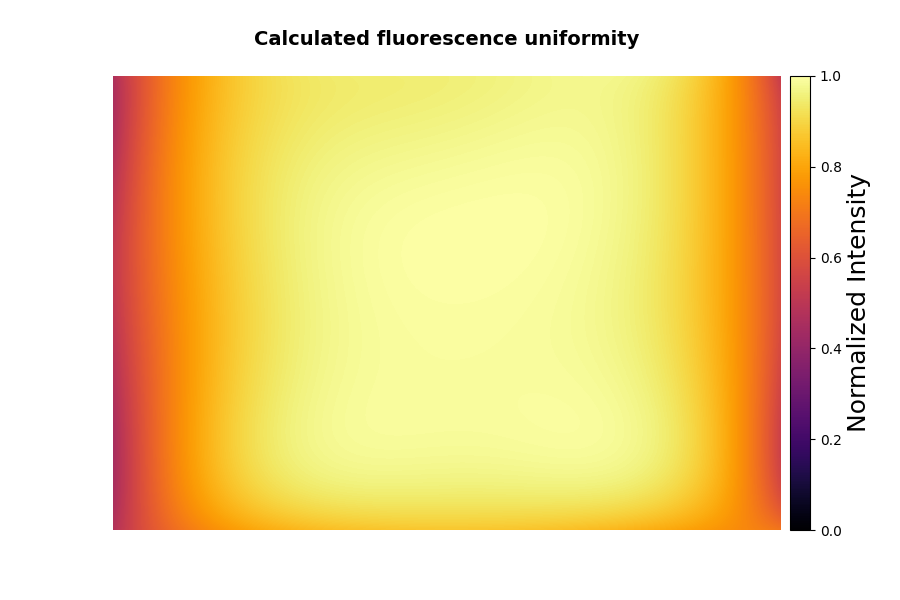
</p>

## Methodology
Following is a general overview of the process of assessing fluorescence uniformity using the qal library. It involves a three-step process:   
- Identification, localization, and quantification of fluorescent wells   
- Fitting fluorescence intensity data to a 2D representation   
- Visualization of the generated surface representation   
   
   
### <br/>Step 1 - Well identification, localization and quantification   
This is achieved using the `detect_dots_uniformity()` method of the `RudDetector` class. It requires a single input, which is the path to the folder where the images to be analyzed are stored. Images in this folder must be of the same dimensions. It is assumed that all images in the folder are to be used in generating the fluorescence uniformity profile across the imaging system's field of view - hence, if only analyzing one image, ensure that that is the only image in the folder. Say the path to the directory containing the input image(s) is `image_dir`, the process is as simple as:   
```python
detector = RudDetector()
detector.detect_dots_uniformity(image_dir)
```
After running, the pixel locations and average intensities of the identified fluorescent wells is stored in the `output` attribute of `detector`. This will be needed as input for the next step.   
   
`RudDetector` has ten parameters that can be defined either upon instantiating the class, or calling the `update_params()` method. The parameters must be provided as a Python dictionary. They are:   
<table>
<tr>
<td width="25%" align="right" valign="top">
Number of thresholding passes
</td>
<td width="75%">
The number of times each input image will be thresholded to find fluorescent wells. On each pass, the identified wells will be removed from the image prior to the next thresholding. Default is <code>1</code>.
</td>
</tr>
<tr>
<td width="25%" align="right" valign="top">
Threshold multipliers
</td>
<td width="75%">
A list of values used to adjust the threshold for finding fluorescent wells. On each pass, the value is multiplied by the binary threshold identified by Otsu's method - this modified threshold is used to binarize the image. If the length of the list provided is greater than 1, it must match the number of thresholding passes. Default is <code>[1]</code>.
</td>
</tr>
<tr>
<td width="25%" align="right" valign="top">
Kernel size (Opening)
</td>
<td width="75%">
Kernel size for the Opening transformation (erosion followed by dilation) used to remove noise after thresholding. Default is <code>5</code>.
</td>
</tr>
<tr>
<td width="25%" align="right" valign="top">
Minimum dot area
</td>
<td width="75%">
The minimum acceptable area in pixels of regions identified as potential fluorescent wells. Consider decreasing if no fluorescent wells are identified. Consider increasing if detection results contain a lot of noise. Default is <code>30</code>.
</td>
</tr>
<tr>
<td width="25%" align="right" valign="top">
Maximum dot area
</td>
<td width="75%">
The maximum acceptable area in pixels of regions identified as potential fluorescent wells. Default is <code>None</code>.
</td>
</tr>
<tr>
<td width="25%" align="right" valign="top">
Maximum eccentricity
</td>
<td width="75%">
The maximum acceptable eccentricity of regions identified as potential fluorescent wells. Eccentricity ranges between 0 to 1, where 0 represents a perfect circle and values closer to 1 represent more elongated ellipses. Default is <code>0.7</code>.
</td>
</tr>
<tr>
<td width="25%" align="right" valign="top">
ROI deletion extra fraction
</td>
<td width="75%">
After each thresholding pass, the identified regions are zeroed out in the image before the next pass. This parameter is a fraction of the height and width of the bounding box of an identified region, by which that bounding box is expanded prior to setting pixel values to zero within that region. This helps to prevent higher intensity well edges and noise from the first pass contaminating the next. Default is <code>0.6</code>.
</td>
</tr>
<tr>
<td width="25%" align="right" valign="top">
Minimum center dots
</td>
<td width="75%">
The minimum number of fluorescent wells that need to be identified within a specified radius from the image center for the image to count towards distortion analysis. Not applicable to uniformity analysis. Default is <code>9</code>.
</td>
</tr>
<tr>
<td width="25%" align="right" valign="top">
Crop images
</td>
<td width="75%">
Whether to zero regions of an image prior to detecting wells. If <code>True</code>, the <code>crop_images()</code> method is called and the user is prompted to demarcate the region of the image to analyze. Images still remain the same size, but everything outside the demarcated region is set to zero. Default is <code>False</code>.
</td>
</tr>
<tr>
<td width="25%" align="right" valign="top">
Show images
</td>
<td width="75%">
Whether to display the intermediate steps in finding fluorescent wells, and the final image containing the identified wells. Intermediate images are the thresholded image, the thresholded image after the Opening transformation, and the bounding boxes of identified regions. Default is <code>False</code>.
</td>
</tr>
</table>

To define parameters when instantiating the class, all parameters must be provided, for example:   
```python
detector = RudDetector(params={
    "Threshold multipliers": [1],
    "Number of thresholding passes": 1,
    "Kernel size (Opening)": 5,
    "Minimum dot area": 30,
    "Maximum dot area": None,
    "Maximum eccentricity": 0.7,
    "ROI deletion extra fraction": 0.6,
    "Minimum center dots": 9,
    "Crop images": False,
    "Show images": False
})
```
 Alternatively, only one or a few parameters can be changed from default using the `update_params()` method:   
```python
detector = RudDetector()
detector.update_params({
    "Minimum dot area": 50,
    "Show images": True
})
```
   
### <br/>Step 2 - 2D surface representation of fluorescent well intensities   
After obtaining locations and intensities of fluorescent wells, a 2D surface representation is generated using the `generate_surf_rep()` method of the `UniformityAnalyzer` class. This method takes as input the output of a `RudDetector` object after calling `detect_dots_uniformity()`. In the simplest case, this requires two lines of code:   
```python
analyzer = UniformityAnalyzer()
analyzer.generate_surf_rep(detector.output)
```
The `output` attribute of `analyzer`  will then contain the data needed for visualization in the final step.   
   
`UniformityAnalyzer` has nine parameters that can be defined either upon instantiating the class, or calling the `update_params()` method. The parameters must be provided as a Python dictionary. They are:   
<table>
<tr>
<td width="25%" align="right" valign="top">
Number of x query points
</td>
<td width="75%">
The x-axis resolution of the generated surface representation. Default is <code>500</code>.
</td>
</tr>
<tr>
<td width="25%" align="right" valign="top">
Number of y query points
</td>
<td width="75%">
The y-axis resolution of the generated surface representation. Default is <code>500</code>.
</td>
</tr>
<tr>
<td width="25%" align="right" valign="top">
Fit method
</td>
<td width="75%">
The method to use in generating the surface representation. Options are: <code>'b-spline'</code> &ndash; fit the data with a bivariate B-spline representation using Scipy's <code>interpolate.bisplrep</code>; and <code>'rbf'</code> &ndash; perform radial basis function interpolation using Scipy's <code>interpolate.RBFInterpolator</code>. The <code>'rbf'</code> method is slower and is recommended for cases where the uniformity profile can be expected to have more structure (non-uniformity). Default is <code>'b-spline'</code>.<br/><br/>
The fit method can also be determined using the <code>method</code> flag in the function call for <code>generate_surf_rep()</code>. This will run the analysis using the specified method but will not change the "Fit method" attribute of the <code>UniformityAnalyzer</code> object. For example:

```python
analyzer.generate_surf_rep(detector.output, method='rbf')
```
</td>
</tr>
<tr>
<td width="25%" align="right" valign="top">
Spline degree
</td>
<td width="75%">
Degree of B-splines used to generate surface representation using <code>scipy.interpolate.bisplrep</code>. Accepted values range from 1 to 5. Default is <code>5</code>.
</td>
</tr>
<tr>
<td width="25%" align="right" valign="top">
RBF smoothing
</td>
<td width="75%">
Smoothing factor used in <code>scipy.interpolate.RBFInterpolator</code> to smooth interpolation with a linear kernel. Set to <code>0</code> for no smoothing. Default is <code>300</code>.
</td>
</tr>
<tr>
<td width="25%" align="right" valign="top">
No negatives in fit
</td>
<td width="75%">
If <code>True</code>, clip negative values in the fit to zero. Default is <code>False</code>.
</td>
</tr>
<tr>
<td width="25%" align="right" valign="top">
Zero outside data range
</td>
<td width="75%">
If <code>True</code>, only generate the surface representation for the region bounded by the identified fluorescent wells (i.e., do not extrapolate). Set everything outside that to zero. Default is <code>False</code>.
</td>
</tr>
<tr>
<td width="25%" align="right" valign="top">
Show fit
</td>
<td width="75%">
If <code>True</code>, show the data points (well locations and intensities) together with the generated 2D B-spline representation. Additionally, print the average squared residual of the fit and a pseudo r-squared. Default is <code>False</code>.
</td>
</tr>
<tr>
<td width="25%" align="right" valign="top">
Save output
</td>
<td width="75%">
If <code>True</code>, a subfolder named "Surface Representation" is created within the folder containing the input images, and outputs are saved here in a pickle file. This also determines whether the images produced by <code>UniformityVisualizer</code> are saved. Default is <code>True</code>. The saved pickle file contains a dictionary whose contents are: <br/>
<br/><b>surf_rep</b>: A 2D array containing the generated fit <br/>
<b>xq</b>: A 1D array containing the x-pixel locations for the fit <br/>
<b>yq</b>: A 1D array containing the y-pixel locations for the fit <br/>
<b>rss</b>: The residual sum of squares for the fit (only present if fit method is <code>'b-spline'</code>)<br/>
<b>r_sq</b>: The pseudo r<sup>2</sup> calculated for the fit (only present if fit method is <code>'b-spline'</code>)<br/>
<b>dots</b>: A dataframe of well locations and their corresponding average intensities <br/>
<b>fov</b>: A tuple containing the y and x dimensions of the field of view <br/>
<b>save_output</b>: A boolean indicating whether outputs are saved <br/>
<b>image_dir</b>: Path to the directory containing input images <br/>
</td>
</tr>
</table>

To define parameters when instantiating the class, all parameters must be provided:   
```python
analyzer = UniformityAnalyzer(params={
    "Number of x query points": 500,
    "Number of y query points": 500,
    "Fit method": 'b-spline',
    "Spline degree": 5,
    "RBF smoothing": 300,
    "No negatives in fit": False,
    "Zero outside data range": False,
    "Show fit": False,
    "Save output": True
})
```
Alternatively, only one or a few parameters can be changed from default using the `update_params()` method:   
```python
analyzer = UniformityAnalyzer()
analyzer.update_params({
    "Zero outside data range": True
})
```
   
### <br/>Step 3 - Visualization   
Final visualization is performed using the `visualize_fluorescence_profiles()` method of the `UniformityVisualizer` class. It requires the output of a `UniformityAnalyzer` object as input. To generate figures visualizing the results:   
```python
visualizer = UniformityVisualizer()
visualizer.visualize_fluorescence_profiles(analyzer.output)
```
   
There are five parameters that can be defined for `UniformityVisualizer` either upon instantiation or by calling the `update_params()` method. The parameters must be provided as a Python dictionary. They are:   
<table>
<tr>
<td width="25%" align="right" valign="top">
n horizontal profiles
</td>
<td width="75%">
The number of horizontal profiles that will be plotted from the 2D B-spline representation. Profiles are spaced evenly across the height of the fit such that if n=3, profiles will be extracted from 1/4, 1/2, and 3/4 of the height. Default is <code>3</code>.
</td>
</tr>
<tr>
<td width="25%" align="right" valign="top">
n vertical profiles
</td>
<td width="75%">
The number of vertical profiles that will be plotted from the 2D B-spline representation. Profiles are spaced evenly across the width of the fit such that if n=3, profiles will be extracted from 1/4, 1/2, and 3/4 of the width. Default is <code>3</code>.
</td>
</tr>
<tr>
<td width="25%" align="right" valign="top">
Iso-levels
</td>
<td width="75%">
A list of ratios of the max intensity for which to generate contours. Contours are drawn for each portion of the field of view that is above each ratio. Default is <code>[0.6, 0.8, 0.9, 0.95]</code>.
</td>
</tr>
<tr>
<td width="25%" align="right" valign="top">
Alpha scaling
</td>
<td width="75%">
A list of transparency values for the iso-contours. Values should range between 0 and 1, and the list should be the same length as Iso-levels. Default is <code>[0.8, 0.8, 0.8, 0.8]</code>.
</td>
</tr>
<tr>
<td width="25%" align="right" valign="top">
Show figures
</td>
<td width="75%">
If <code>True</code>, display the figures as they are generated. This does not affect whether or not the figures are saved as image files - that is determined by the input <code>UniformityAnalyzer</code> object. Default is <code>False</code>.
</td>
</tr>
</table>

To define parameters when instantiating the class, all parameters must be provided:   
```python
visualizer = UniformityVisualizer(params={
    "n horizontal profiles": 3,
    "n vertical profiles": 3,
    "Iso-levels": [0.6, 0.8, 0.9, 0.95],
    "Alpha scaling": [0.8, 0.8, 0.8, 0.8],
    "Show figures": False
})
```
Alternatively, only one or a few parameters can be changed from default using the `update_params()` method:   
```python
visualizer = UniformityVisualizer()
visualizer.update_params({
    "Iso-levels": [0.5, 0.65, 0.75, 0.85, 0.9, 0.95],
    "Alpha scaling": [1, 1, 1, 1, 1, 1]
})
```
   
   
## <br/>Examples   
### Visualize fluorescence profile for a reasonably flat imaging system   
This example shows the process and outputs for analyzing images from a reasonably flat (in terms of fluorescence uniformity) imaging system. The images used in this example are downloaded from the repository, and can also be found at: **qal/data/rud_targets/example_1**. First, the necessary imports are made:   
```python
from qal.data import rud_example_1
from qal import RudDetector, UniformityAnalyzer, UniformityVisualizer
```
The images are downloaded and the path to the folder containing them is assigned to `image_dir`, then the images are processed to extract well positions and intensities:   
```python
image_dir = rud_example_1()

detector = RudDetector()
detector.detect_dots_uniformity(image_dir)
rud_dots = detector.output
```
Next, the extracted data is used to generate a 2D fluorescence profile. For this example, the outputs will not be saved, so the `"Save output"` parameter is set to `False` (note that if you choose to change this to `True`, the outputs will be saved to the same location the images were downloaded to):   
```python
analyzer = UniformityAnalyzer()
analyzer.update_params({
    "Save output": False
})
analyzer.generate_surf_rep(rud_dots)
analyzer_output = analyzer.output
```
Finally, the results are visualized. Since the outputs are not being saved in this example, the figures will be displayed as they are generated:   
```python
visualizer = UniformityVisualizer()
visualizer.update_params({
    "Show figures": True
})
visualizer.visualize_fluorescence_profiles(analyzer_output)
```
After running the code, the following messages are printed to the command line:   
```
GENERATING SURFACE REPRESENTATION
Extracting data from image 1 of 4...
  Finding wells, pass 1 of 1...
Extracting data from image 2 of 4...
  Finding wells, pass 1 of 1...
Extracting data from image 3 of 4...
  Finding wells, pass 1 of 1...
Extracting data from image 4 of 4...
  Finding wells, pass 1 of 1...

PERFORMING B-SPLINE FITTING...

GENERATING FIGURES...
```
Then, seven figures are displayed. The first two are an animation showing a 3D projection of the fit, and a figure showing its 2D projection:
<p align="center">
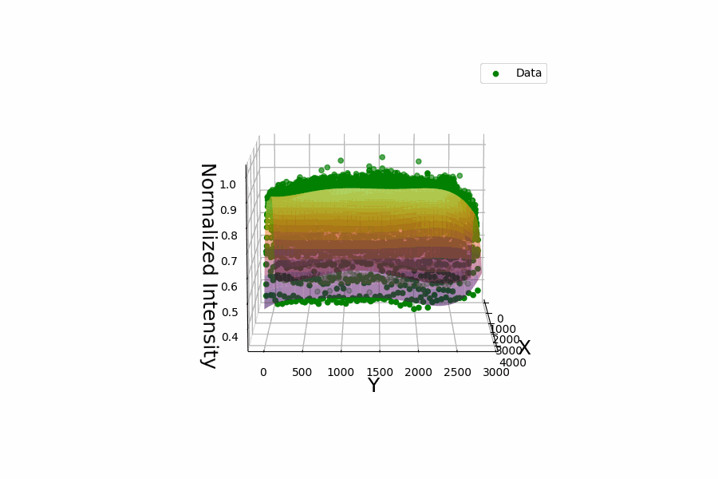
</p>
<p align="center">

</p>
 
The next three figures show horizontal and vertical profiles at specific locations across the field of view:   
<p align="center">
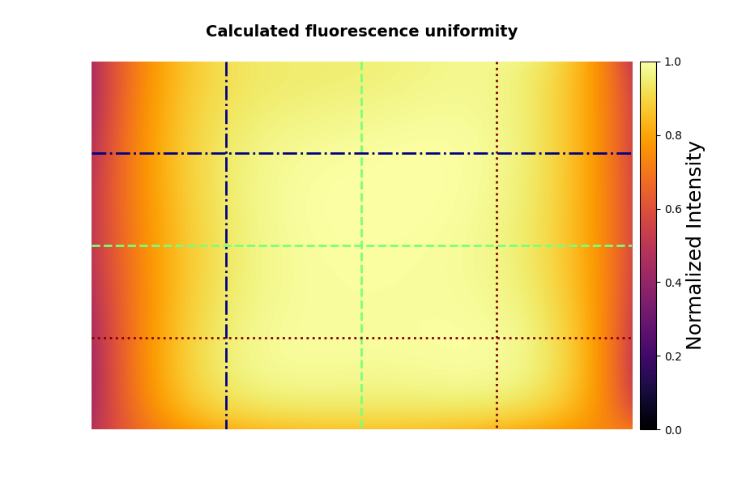
</p>
<p align="center">
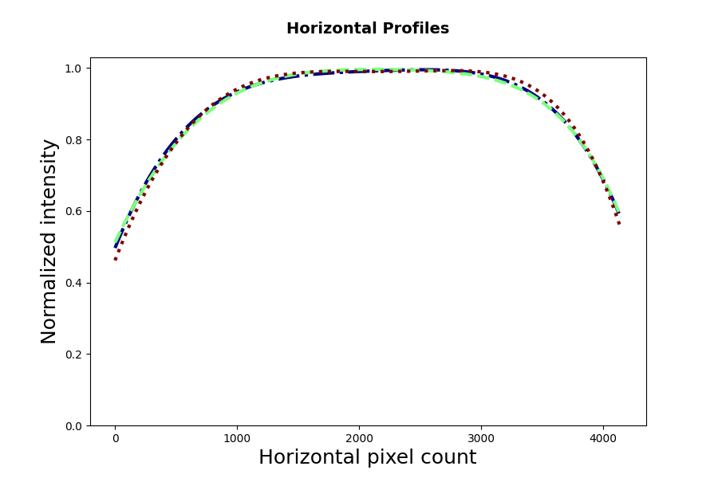
</p>
<p align="center">

</p>
   
The final two figures are a contour map showing regions of the field of view that are at least a specified level of the max intensity (fitted), and a table that shows what fraction of the field of view has pixels within each iso-level. In this example, almost half of the field of view is above 95% of the max intensity:   
<p align="center">
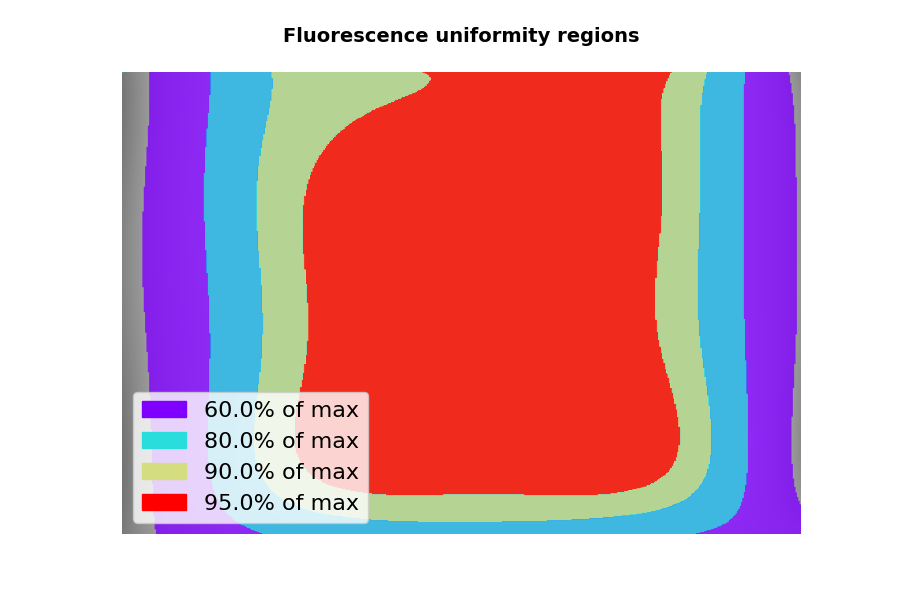
</p>
<p align="center">

</p> 

### <br/>Visualize fluorescence profile for a highly non-uniform imaging system   
This example shows a more challenging case where the fluorescence collection profile of the imaging system is highly non-uniform. As a result, parameters needed to be adjusted in order to obtain a good representation. The images used in this example are located in **qal/data/rud_targets/example_2**. If the same code in the previous example is run on these images, the generated fluorescence profile will look like this:   
<p align="center">
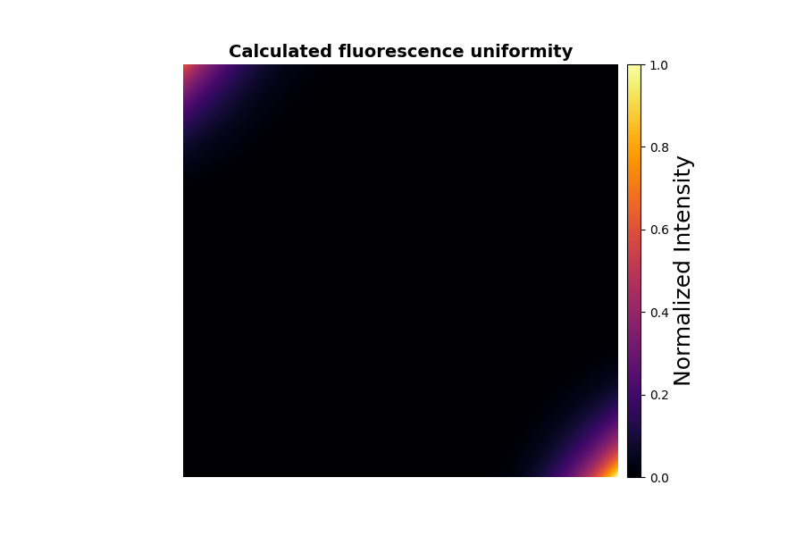
</p> 

There appears to be no fluorescence sensitivity in the center of the image and two hotspots in the top left and bottom right corners. However, this is because the identified wells were all in the center of the image, and in an attempt to extrapolate the fit, values in the top left and bottom right of the field of view increased exponentially. Setting `"Show images"` to `True` in the first step helps troubleshoot the well identification process:   
```python
from qal.data import rud_example_2
from qal import RudDetector, UniformityAnalyzer, UniformityVisualizer

image_dir = rud_example_2()

detector = RudDetector()
detector.update_params({
    "Show images": True
})
detector.detect_dots_uniformity(image_dir)
```
The following two figures are produced for the first input image, showing that a subset of wells in the center of the image are identified (identified wells are presented as green dots overlaid on the original input image):   
<p align="center">
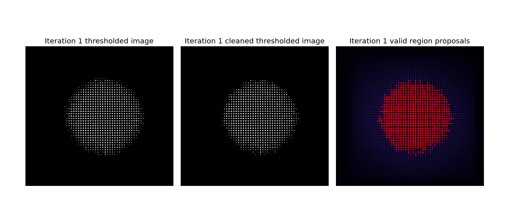
</p> 
<p align="center">
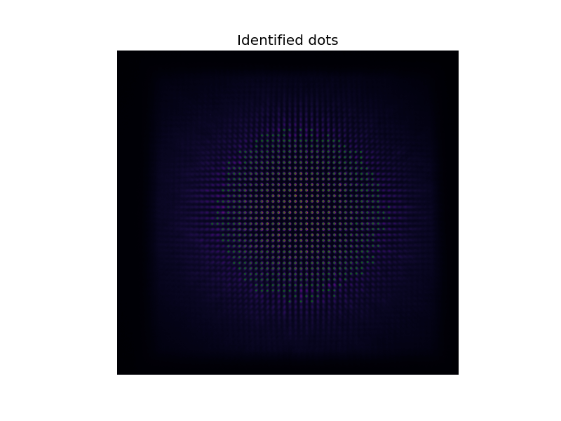
</p> 

While the input images are not of the best quality, it is evident that some more wells could have been identified. To try and increase the number of identified wells, additional thresholding passes were added. Through trial-and-error, appropriate threshold multipliers were identified for each pass. Furthermore, these input images display a good amount of spherical and coma aberration so that wells further out from the image center get blurrier and elongated like a comet. For this reason, the maximum allowed eccentricity of identified regions was increased to 1. To help clean up the images better after each thresholding pass, the fraction by which each bounding box is expanded prior to setting to zero was also increased to 1. The updated Python code is shown below:   
```python
detector = RudDetector()
detector.update_params({
    "Number of thresholding passes": 4,
    "Threshold multipliers": [1, 3.5, 3, 2.8],
    "Maximum eccentricity": 1,
    "ROI deletion extra fraction": 1,
    "Show images": True
})
detector.detect_dots_uniformity(image_dir)
rud_dots = detector.output
```
More wells are now identified. There is also a little bit of noise that gets identified as wells - however, these are so few in comparison to the number of data points that they should not affect the results. The image below shows the wells identified for the first input image:   
<p align="center">
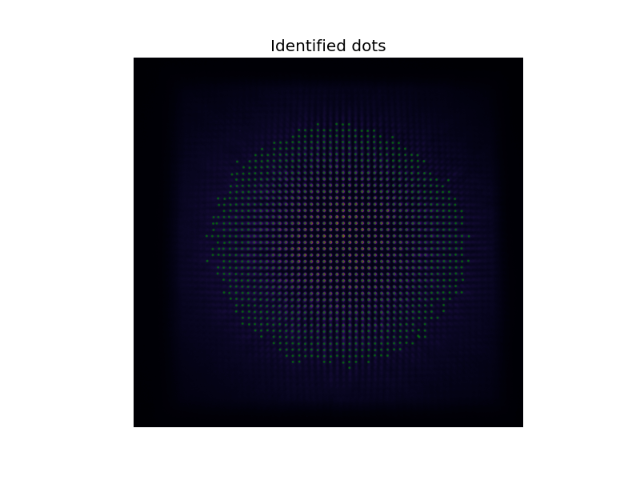
</p> 

Even though more wells have been identified, they still do not span the field of view. Hence, there is still a likelihood that the fitted B-spline representation explodes as it extrapolates outside the data range. To prevent this, the fit will only be generated within the data range. As in the previous example, outputs will not be saved, only displayed:   
```python
analyzer = UniformityAnalyzer()
analyzer.update_params({
    "Zero outside data range": True,
    "Save output": False
})
analyzer.generate_surf_rep(rud_dots)
analyzer_output = analyzer.output

visualizer = UniformityVisualizer()
visualizer.update_params({
    "Show figures": True
})
visualizer.visualize_fluorescence_profiles(analyzer_output)
```
The results show that this imaging system has a narrow gaussian-shaped fluorescence uniformity profile - only about 5% of the field of view is at least 80% of the max intensity.   
<p align="center">
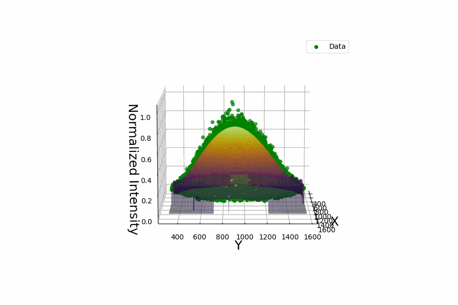
</p>
<p align="center">
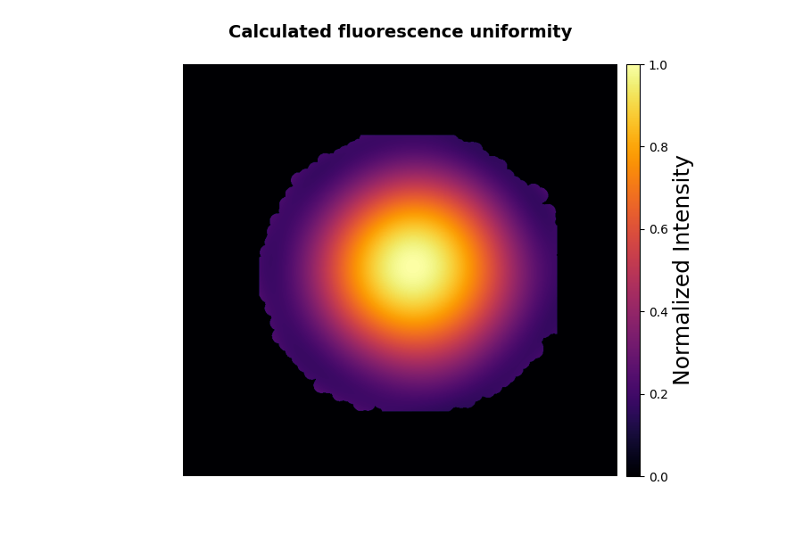
</p>
<p align="center">
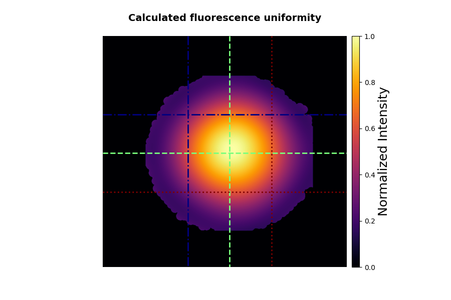
</p>
<p align="center">
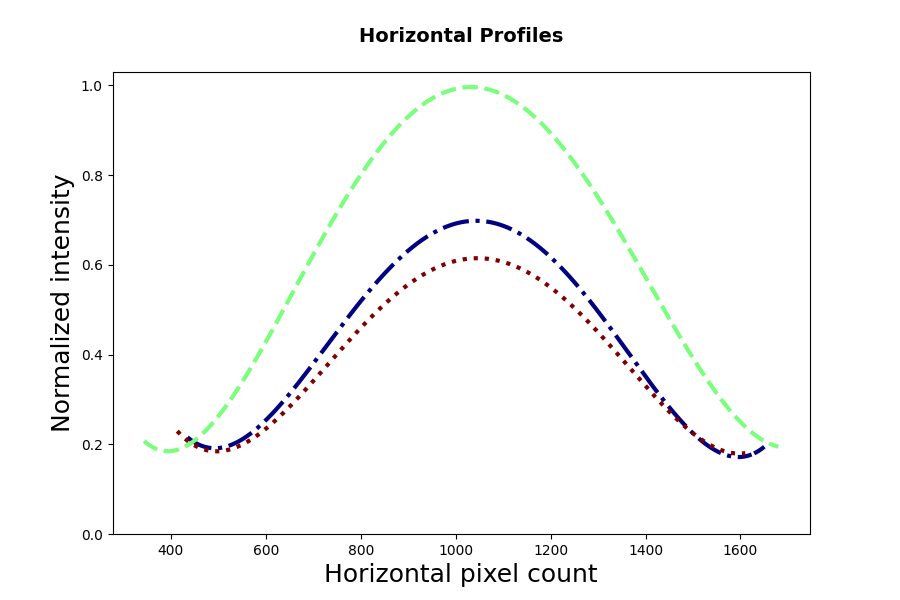
</p>
<p align="center">
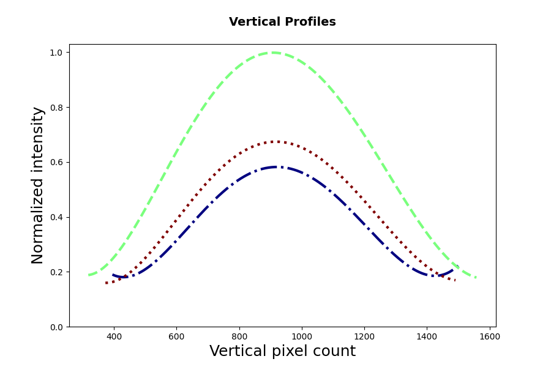
</p>
<p align="center">
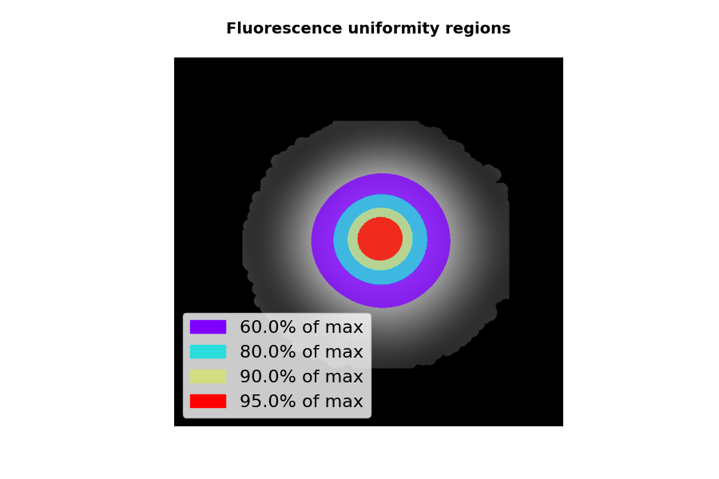
</p>
<p align="center">
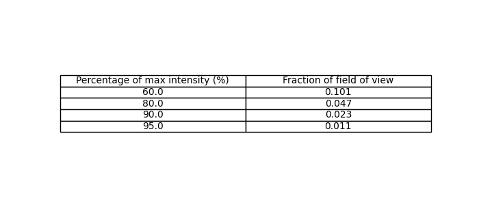
</p> 
   
### <br/>Visualize fluorescence profile using RBF interpolation   
Some detailed structures may not be captured by the B-spline fitting method. In this example, the images from the first example are reanalyzed using the alternative RBF interpolation method. This requires one small change to the code:
```python
from qal.data import rud_example_1
from qal import RudDetector, UniformityAnalyzer, UniformityVisualizer

image_dir = rud_example_1()

detector = RudDetector()
detector.detect_dots_uniformity(image_dir)
rud_dots = detector.output

analyzer = UniformityAnalyzer()
analyzer.update_params({
    "Fit method": 'rbf',
    "Save output": False
})
analyzer.generate_surf_rep(rud_dots)
analyzer_output = analyzer.output

visualizer = UniformityVisualizer()
visualizer.update_params({
    "Show figures": True
})
visualizer.visualize_fluorescence_profiles(analyzer_output)
```
The text printed to the screen upon running this code is slightly different from before:
```
GENERATING SURFACE REPRESENTATION
Extracting data from image 1 of 4...
  Finding wells, pass 1 of 1...
Extracting data from image 2 of 4...
  Finding wells, pass 1 of 1...
Extracting data from image 3 of 4...
  Finding wells, pass 1 of 1...
Extracting data from image 4 of 4...
  Finding wells, pass 1 of 1...

PERFORMING RBF INTERPOLATION...
  Finding function representing input data...
  Generating surface representation...

GENERATING FIGURES...
```
And the figures displayed show that there is a double border to the uniformity profile (evident on the left and right edges) that was not captured by the default B-spline method.
<p align="center">
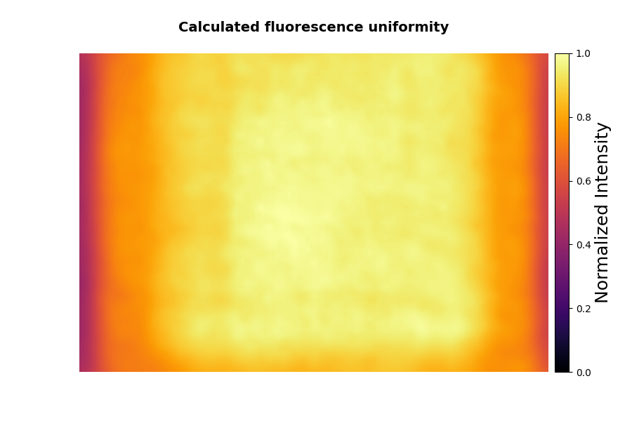
</p> 

### <br/>Happy accidents
Trial and error is sometimes unavoidable when it comes to R&D. We at QUEL Imaging believe it is important to look for the silver lining in every mistake &ndash; like Bob Ross said, "We don't make mistakes, just happy little accidents". With that being said, this example introduces you to the happy result of one of our failed early R&D efforts in manufacturing the RUD target. The image used can be found in the repository at **qal/data/rud_targets/example_4**. Run the following lines of code to see the unexpected ghost we found lurking in this target:
```python
from qal.data import rud_example_4
from qal import RudDetector, UniformityAnalyzer, UniformityVisualizer

image_dir = rud_example_4()

detector = RudDetector()
detector.detect_dots_uniformity(image_dir)

analyzer = UniformityAnalyzer()
analyzer.update_params({
    "Zero outside data range": True,
    "Save output": False
})
analyzer.generate_surf_rep(detector.output)

visualizer = UniformityVisualizer()
visualizer.update_params({
    "Show figures": True
})
visualizer.visualize_fluorescence_profiles(analyzer.output)
```
We named him Paul (what better name for a RUD?). Try playing around with the visualizer parameters, in particular the "Iso-levels" parameter, and see what effect that has on Paul. If you are careful, you might be able to give Paul's head some more definition and make him happier:
<p align="center">
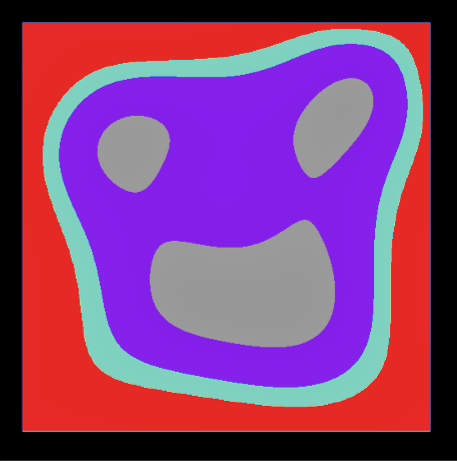
</p>

Remember, "You too can paint almighty pictures."

# <br/>Distortion Analysis
## Quick Start
The following block of code can be used to obtain geometric distortion assessment from well-taken images (see the RUD use guide) spanning the field of view of the imaging system. The outputs will be stored a subfolder called "Distortion Figures" created within the input data folder. The input folder must contain images of the same size. Continue reading this document for an understanding of the process and how to adapt it.
```python
from qal import RudDetector, DistortionAnalyzer, DistortionVisualizer

image_dir = "***Replace-with-path-to-your-image-directory***"

detector = RudDetector()
detector.detect_dots_distortion(image_dir)

analyzer = DistortionAnalyzer()
analyzer.compute_distortion(detector.output)

visualizer = DistortionVisualizer()
visualizer.visualize_distortion(analyzer.output)
```
Here is an example of the output that can be expected from the code:
<p align="center">
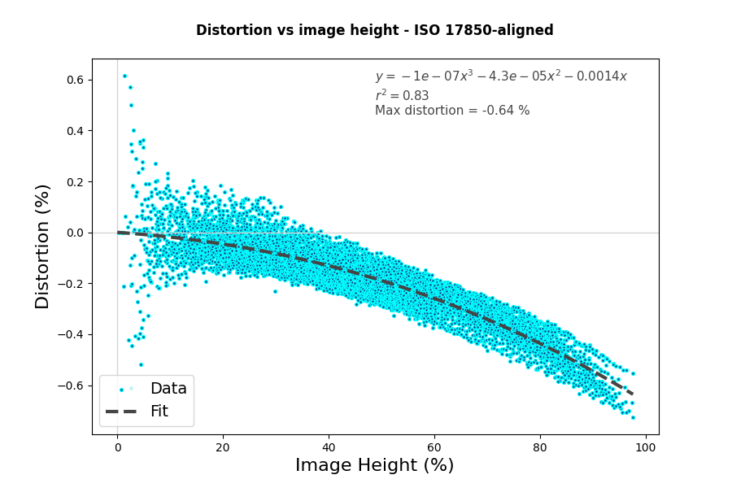
</p>

## Methodology
Following is a general overview of the process of calculating local geometric distortion from images of the RUD target using the qal library. Similar to uniformity analysis, it involves a three-step process:   
- Identification and localization of fluorescent wells
- Computing local geometric distortion for identified wells
- Visualization of the distortion

Note that distortion analysis using the qal library is meant to assess radial (barrel and pincushion) distortion, though the presence of keystone distortion may be highlighted (see the RUD use guide). This should be corrected, if possible, prior to re-imaging and re-analyzing.


### <br/>Step 1 - Well identification and localization   
This is achieved using the `detect_dots_distortion()` method of the `RudDetector` class presented in the uniformity analysis section of this document. Similar to its counterpart, it requires a single input, which is the path to the folder where the images to be analyzed are stored. Images in this folder must be of the same dimensions, and it is assumed that all images in the folder are to be used in calculating distortion across the imaging system's field of view - hence, if only analyzing one image, ensure that this is the only image in the folder. This step can be performed with the following commands:
```python
detector = RudDetector()
detector.detect_dots_distortion(image_dir)
```
where `image_dir` is the path to the folder containing the input image(s). After running, the pixel locations of the identified fluorescent wells is stored in the `output` attribute of `detector`, which will be needed for the next step.

`RudDetector` has ten parameters that can be defined either upon instantiating the class or by calling the `update_params()` method. These were presented in Step 1 of the uniformity analysis methodology, and are repeated here:
<table>
<tr>
<td width="25%" align="right" valign="top">
Number of thresholding passes
</td>
<td width="75%">
The number of times each input image will be thresholded to find fluorescent wells. On each pass, the identified wells will be removed from the image prior to the next thresholding. Default is <code>1</code>.
</td>
</tr>
<tr>
<td width="25%" align="right" valign="top">
Threshold multipliers
</td>
<td width="75%">
A list of values used to adjust the threshold for finding fluorescent wells. On each pass, the value is multiplied by the binary threshold identified by Otsu's method - this modified threshold is used to binarize the image. If the length of the list provided is greater than 1, it must match the number of thresholding passes. Default is <code>[1]</code>.
</td>
</tr>
<tr>
<td width="25%" align="right" valign="top">
Kernel size (Opening)
</td>
<td width="75%">
Kernel size for the Opening transformation (erosion followed by dilation) used to remove noise after thresholding. Default is <code>5</code>.
</td>
</tr>
<tr>
<td width="25%" align="right" valign="top">
Minimum dot area
</td>
<td width="75%">
The minimum acceptable area in pixels of regions identified as potential fluorescent wells. Consider decreasing if no fluorescent wells are identified. Consider increasing if detection results contain a lot of noise. Default is <code>30</code>.
</td>
</tr>
<tr>
<td width="25%" align="right" valign="top">
Maximum dot area
</td>
<td width="75%">
The maximum acceptable area in pixels of regions identified as potential fluorescent wells. Default is <code>None</code>.
</td>
</tr>
<tr>
<td width="25%" align="right" valign="top">
Maximum eccentricity
</td>
<td width="75%">
The maximum acceptable eccentricity of regions identified as potential fluorescent wells. Eccentricity ranges between 0 to 1, where 0 represents a perfect circle and values closer to 1 represent more elongated ellipses. Default is <code>0.7</code>.
</td>
</tr>
<tr>
<td width="25%" align="right" valign="top">
ROI deletion extra fraction
</td>
<td width="75%">
After each thresholding pass, the identified regions are zeroed out in the image before the next pass. This parameter is a fraction of the height and width of the bounding box of an identified region, by which that bounding box is expanded prior to setting pixel values to zero within that region. This helps to prevent higher intensity well edges and noise from the first pass contaminating the next. Default is <code>0.6</code>.
</td>
</tr>
<tr>
<td width="25%" align="right" valign="top">
Minimum center dots
</td>
<td width="75%">
The minimum number of fluorescent wells that need to be identified within a specified radius from the image center for the image to count towards distortion analysis. Not applicable to uniformity analysis. Default is <code>9</code>.
</td>
</tr>
<tr>
<td width="25%" align="right" valign="top">
Crop images
</td>
<td width="75%">
Whether to zero regions of an image prior to detecting wells. If <code>True</code>, the <code>crop_images()</code> method is called and the user is prompted to demarcate the region of the image to analyze. Images still remain the same size, but everything outside the demarcated region is set to zero. Default is <code>False</code>.
</td>
</tr>
<tr>
<td width="25%" align="right" valign="top">
Show images
</td>
<td width="75%">
Whether to display the intermediate steps in finding fluorescent wells, and the final image containing the identified wells. Intermediate images are the thresholded image, the thresholded image after the Opening transformation, and the bounding boxes of identified regions. Default is <code>False</code>.
</td>
</tr>
</table>

### <br/>Step 2 - Computing local geometric distortion  
In this step, local geometric distortion is calculated following the principles of ISO 17850:2015 (note that strict adherence to the standard also puts constraints on the target and how it is imaged - see the standard for more information). This is done using the `compute_distortion()` method of the `DistortionAnalyzer` class. It takes one required and three optional inputs. The required input is the output of a `RudDetector` object after calling `detect_dots_distortion()`. In the simplest case, distortion can be computed using:
```python
analyzer = DistortionAnalyzer()
analyzer.compute_distortion(detector.output)
```
The `output` attribute of `analyzer` now contains data needed for visualization in the final step.

When called, `compute_distortion()` uses the input data to generate a grid of expected well positions based on the average spacing and angular orientation of wells closest to the center of the image. The expected positions are paired with their corresponding actual positions, and local geometric distortion is calculated as in ISO 17850:2015. Additionally, a 2D B-spline fit of the distortion data is generated. The three optional inputs for `compute_distortion()` are:
<table>
<tr>
<td width="25%" align="right" valign="top">
show_dots
</td>
<td width="75%">
If <code>True</code>, intermediate figures showing the actual (black dots) and expected (red empty circles) well positions are displayed. Default is <code>False</code>.
</td>
</tr>
<tr>
<td width="25%" align="right" valign="top">
ignore_extra
</td>
<td width="75%">
If <code>True</code>, do not extrapolate outside the data range when generating the 2D distortion map. Default is <code>False</code>.
</td>
</tr>
<tr>
<td width="25%" align="right" valign="top">
save_output
</td>
<td width="75%">
If <code>True</code>, a subfolder named "Distortion Figures" is created within the folder containing the input images, and the outputs are saved to a pickle file. This can be used to recreate images generated in the final step. Default is <code>False</code>. The saved pickle file contains a dictionary whose contents are: <br/>
<br/><b>Actual distances</b>: A 1D array containing distances from each identified well to the center of the image <br/>
<b>Distortion</b>: A 1D array containing calculated distortion for each identified well <br/>
<b>FOV</b>: A tuple containing the y and x dimensions of the field of view <br/>
<b>xq</b>: A 1D array containing the x-pixel locations for the fitted distortion map <br/>
<b>yq</b>: A 1D array containing the y-pixel locations for the fitted distortion map <br/>
<b>Distortion map</b>: A 2D array containing the fitted distortion map <br/>
<b>Directory</b>: Path to the directory containing input images <br/>
<b>dots</b>: A list of dataframes containing identified well positions and intensities <br/>
</td>
</tr>
</table>

Example use:
```python
analyzer.compute_distortion(detector.output, show_dots=True, ignore_extra=True, save_output=True)
```

### <br/>Step 3 - Visualization  
Final visualization is performed using the `visualize_distortion()` method of the `DistortionAnalyzer` class. It requires the output of a `DistortionAnalyzer` object as input. Visualize analysis results using the following:
```python
visualizer = DistortionVisualizer()
visualizer.visualize_distortion(analyzer.output)
```
`visualize_distortion()` also has two optional inputs:
<table>
<tr>
<td width="25%" align="right" valign="top">
save
</td>
<td width="75%">
Determines whether the figures generated are saved. If <code>True</code>, the figures are saved to a subfolder created within the input data folder called "Distortion Figures". Default is <code>True</code>.
</td>
</tr>
<tr>
<td width="25%" align="right" valign="top">
lens_maker
</td>
<td width="75%">
If <code>True</code>, an optional figure is generated in which distortion is on the horizontal axis and image height on the vertical axis, like in plots provided by some lens manufacturers. Default is <code>False</code>.
</td>
</tr>
</table>

Example use:
```python
visualizer.visualize_distortion(analyzer.output, save=False)
```


## <br/>Examples   
### Assess distortion across the entire field of view
In this example, distortion is analyzed from a set of images that span the field of view of the imaging system. The images used are downloaded from the repository, but can also be found at: **qal/data/rud_targets/example_1**. First, the necessary imports are made:
```python
from qal.data import rud_example_1
from qal import RudDetector, DistortionAnalyzer, DistortionVisualizer
```
The images are downloaded and the path to the folder containing them is assigned to `image_dir`, then the images are processed to extract well positions:   
```python
image_dir = rud_example_1()

detector = RudDetector()
detector.detect_dots_uniformity(image_dir)
rud_dots = detector.output
```
Next, distortion is calculated from the data points:
```python
analyzer = DistortionAnalyzer()
analyzer.compute_distortion(rud_dots)
analyzer_output = analyzer.output
```
Finally, the results are visualized. In this example, the figures will not be saved, only displayed. The optional figure presenting distortion on the horizontal axis will also be generated.
```python
visualizer = DistortionVisualizer()
visualizer.visualize_distortion(analyzer_output, save=False, lens_maker=True)
```
After running, the following messages are printed to the command line:
```
FINDING WELLS
Extracting data from image 1 of 4...
  Finding wells, pass 1 of 1...
Extracting data from image 2 of 4...
  Finding wells, pass 1 of 1...
Extracting data from image 3 of 4...
  Finding wells, pass 1 of 1...
Extracting data from image 4 of 4...
  Finding wells, pass 1 of 1...

PERFORMING B-SPLINE FITTING...

GENERATING FIGURES...
```
And the following three figures are displayed. The first is a scatter plot of the computed distortion as a function of image height, i.e., distance from the center of the image. Image height is plotted as a percentage so that 100% is the maximum distance from the image center. Each data point represents the local geometric distortion at that image height for a fluorescent well that was identified. The figure additionally contains a 3<sup>rd</sup> degree polynomial fit to the data and reports the maximum distortion:
<p align="center">

</p>

The second figure is the polynomial fit from the first figure, with the axes switched so that distortion is on the horizontal axis - this way of displaying a distortion curve may be more familiar to some users:  
<p align="center">
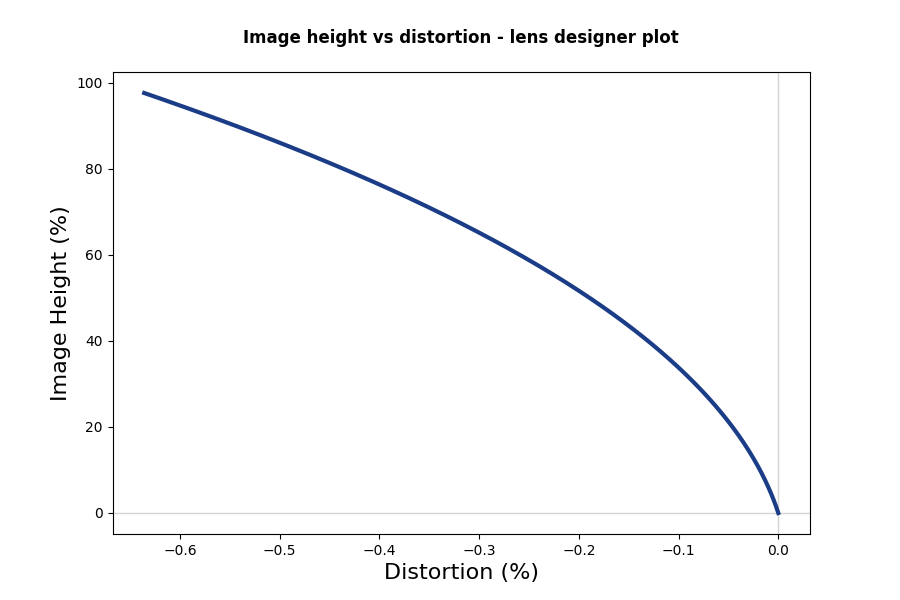
</p>

The final figure is a fitted 2D map of the distortion across the field of view. This should ideally be radially-symmetric:  
<p align="center">
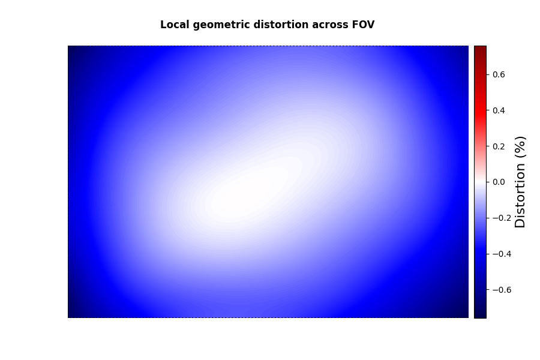
</p>

### <br/>Assess distortion across a portion of the field of view
In this example, there is only one input image which does not span the field of view. The image for this example can be found in **qal/data/rud_targets/example_3**. Running the code from the previous example unchanged will result in larger values towards the edges of the field of view in the distortion map. To avoid this, a small change needs to be made to the `compute_distortion` call:
```python
from qal.data import rud_example_3
from qal import RudDetector, DistortionAnalyzer, DistortionVisualizer

image_dir = rud_example_3()

detector = RudDetector()
detector.detect_dots_uniformity(image_dir)
rud_dots = detector.output

analyzer = DistortionAnalyzer()
analyzer.compute_distortion(rud_dots, ignore_extra=True)
analyzer_output = analyzer.output

visualizer = DistortionVisualizer()
visualizer.visualize_distortion(analyzer_output, save=False)
```
This produces the following figures in which distortion is only evaluated up to an image height of about 80%:
<p align="center">

</p>
<p align="center">
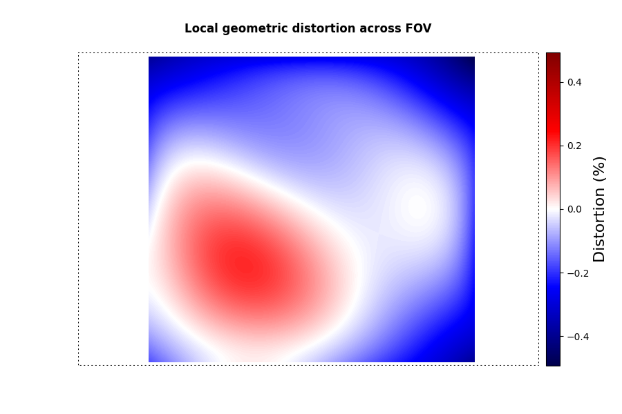
</p>